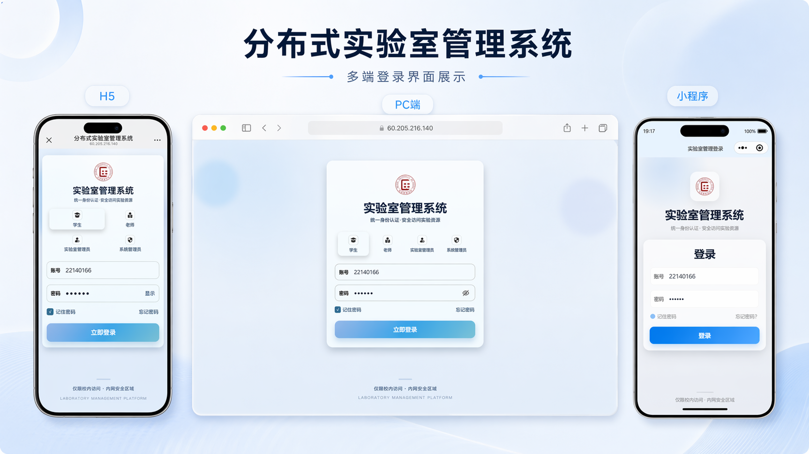
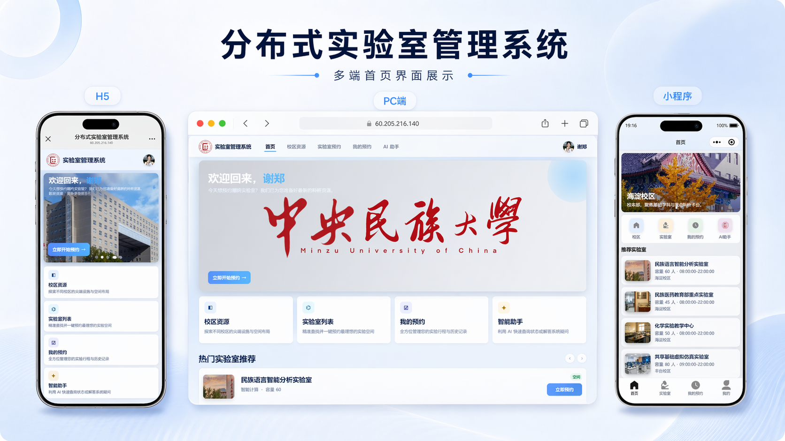
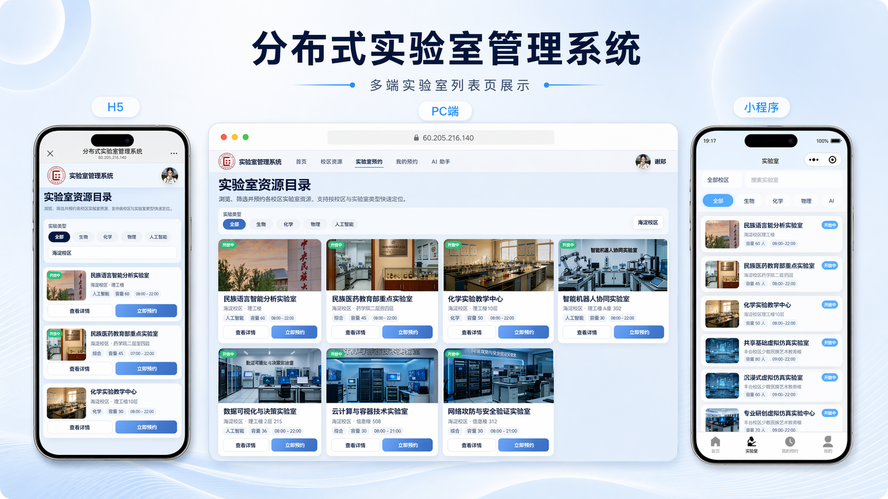
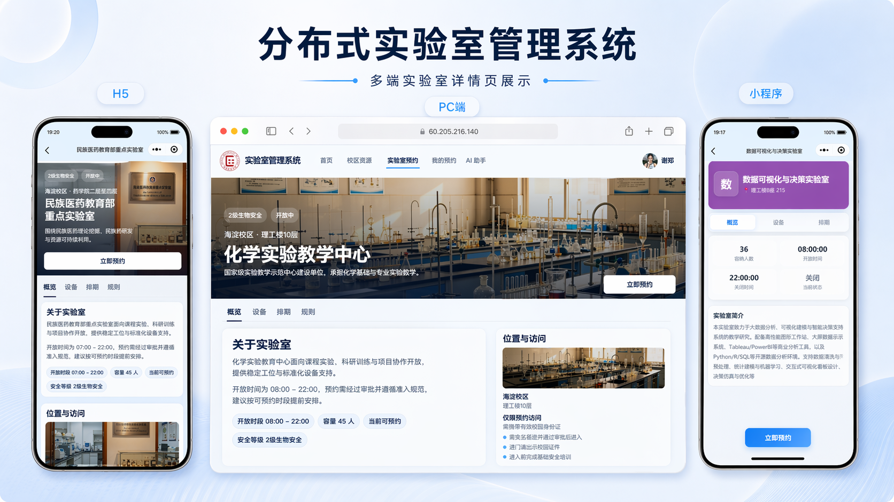
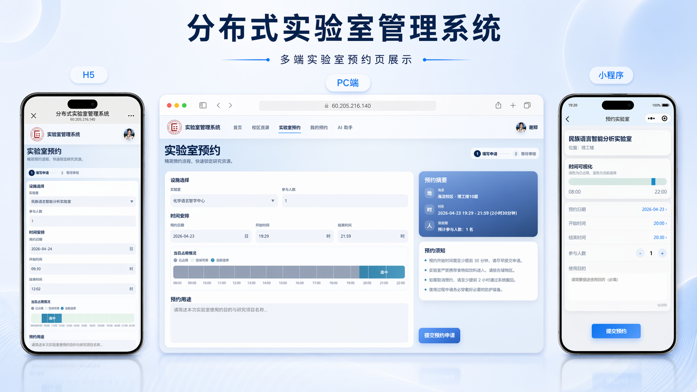
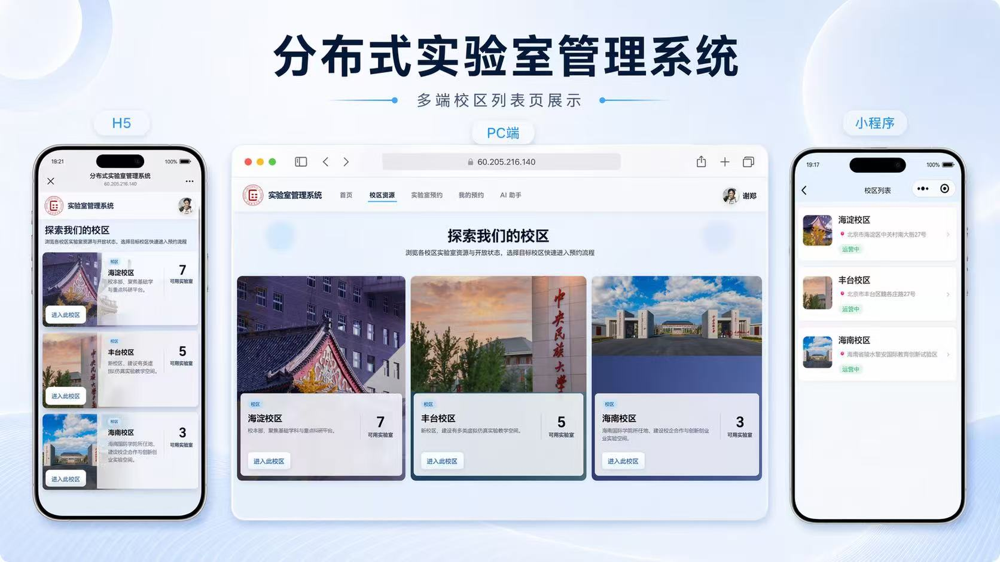
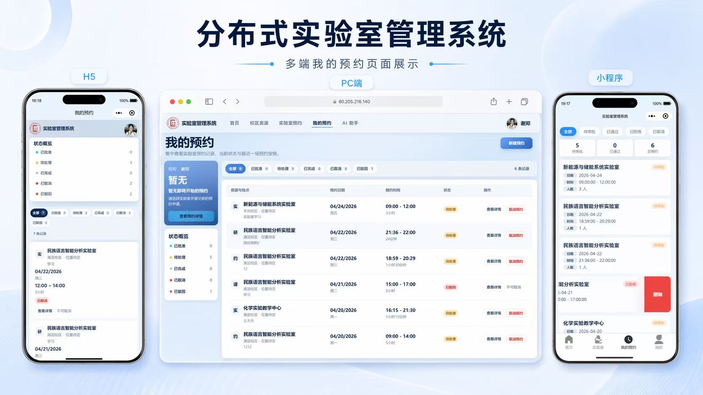
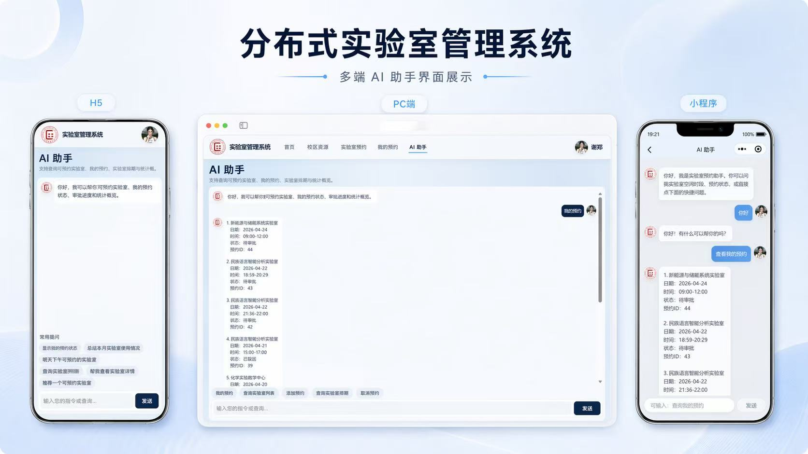

# 支持跨校区协作的分布式实验室管理系统

毕业设计项目，面向“多校区实验室资源共享 + 预约审批 + 数据统计 + AI 助手”场景，提供：

- Flask 后端 API（统一权限、预约规则、审批流）
- uni-app Web/H5 前端（用户端 + 管理端）
- 微信小程序端（移动端预约主流程）
- Agent 智能助手（规则引擎 + 可选 LLM）

## 项目亮点

- 多角色权限模型：`student`、`teacher`、`lab_admin`、`system_admin`
- 多校区资源管理：校区、实验室、设备统一维护
- 完整预约闭环：创建、冲突校验、审批、取消、详情追踪
- 统计分析看板：总览、校区维度、实验室利用率
- 智能问答助手：支持“查可用实验室 / 查排期 / 预约建议 / 快速跳转”
- 前后端分离：同一后端同时服务 Web 与微信小程序

## 系统架构

```text
Web(H5, uni-app) ─┐
                  ├──> Flask API (/api/*) ───> MySQL / SQLite
微信小程序         ─┘            │
                                ├── 预约规则引擎（冲突、开放时段、人数等）
                                ├── 审批与操作日志
                                └── Agent（rule / openai / deepseek）
```

## 项目截图

> 每张截图同时展示 PC 端、H5 端、微信小程序端

| 登录 | 首页 | 实验室列表 |
|------|------|------------|
|  |  |  |

| 实验室详情 | 实验室预约 | 校区列表 |
|------------|------------|----------|
|  |  |  |

| 我的预约 | AI 助手 |
|----------|---------|
|  |  |

## 技术栈

### 后端
- Flask 3
- Flask-SQLAlchemy / SQLAlchemy
- Flask-Migrate
- Flask-JWT-Extended
- Flask-CORS
- requests（LLM 调用）

### 前端
- uni-app（`frontend/`）
- 自定义组件化页面结构（用户端与管理端共存）

### 小程序
- 微信原生小程序（`miniprogram/`）

### 数据库
- 开发环境：SQLite（默认回退）
- 生产环境：MySQL（推荐）

## 目录结构

```text
lab/
├─ backend/                        # Flask 后端
│  ├─ app/
│  │  ├─ api/                      # 路由层
│  │  ├─ models/                   # 数据模型
│  │  ├─ services/                 # 核心业务逻辑
│  │  └─ utils/                    # 装饰器、响应、校验、异常
│  ├─ migrations/                  # 迁移脚本/说明
│  ├─ scripts/                     # 运维脚本（分库初始化/检测/测试）
│  ├─ .env.example
│  ├─ run.py
│  └─ start_server.py
├─ frontend/                       # uni-app Web/H5 端
│  ├─ pages/                       # 用户端 + 管理端页面
│  ├─ components/
│  ├─ api/
│  ├─ common/
│  └─ config/navigation.js
├─ miniprogram/                    # 微信小程序端
│  ├─ pages/
│  ├─ utils/
│  ├─ app.json
│  └─ project.config.json
├─ benchmark/                      # 并发压测脚本与说明
└─ README.md
```

## 功能模块

### 用户端（Web/H5 + 小程序）
- 登录鉴权
- 校区浏览
- 实验室检索与详情查看
- 实验室排期查看
- 创建预约与取消预约
- 我的预约列表与预约详情
- 个人信息维护
- AI 助手问答

### 管理端（Web/H5）
- 校区管理（系统管理员）
- 实验室管理
- 设备管理
- 预约审批
- 用户管理（系统管理员）
- 操作日志审计
- 统计分析看板

## 角色权限说明

| 角色 | 典型能力 |
|---|---|
| `student` | 查看资源、发起预约、查看自己的预约 |
| `teacher` | 查看资源、发起教学预约、查看自己的预约 |
| `lab_admin` | 管理本校区实验室/设备、审批本校区预约、查看统计与日志 |
| `system_admin` | 跨校区全量管理（校区/用户/资源/审批/统计） |

## 快速开始（本地开发）

### 1. 启动后端（Flask）

```bash
cd backend
python -m venv .venv
```

Windows:

```bash
.venv\Scripts\activate
```

macOS / Linux:

```bash
source .venv/bin/activate
```

安装依赖并初始化：

```bash
pip install -r requirements.txt
copy .env.example .env
python scripts/bootstrap_shards.py
python scripts/seed_shards.py
python run.py
```

后端默认地址：`http://127.0.0.1:5000`

### 2. 运行 Web/H5 前端（uni-app）

推荐使用 HBuilderX 打开 `frontend/`：

- 运行到浏览器（H5）
- 需要打包时使用 HBuilderX 发布流程

前端 API 根地址逻辑（`frontend/common/platform.js`）：

- 本地访问（localhost/127.0.0.1）默认走 `http://127.0.0.1:5000/api`
- 非本地部署默认走同域 `/api`（适配反向代理）

### 3. 运行微信小程序

使用微信开发者工具导入 `miniprogram/`。

- 默认 `appid`：`wxb3d15e0804a6f2c3`（可替换为你的 AppID）
- 请求地址在 `miniprogram/utils/request.js` 中配置（默认 `http://127.0.0.1:5000/api`）

## 环境变量（backend/.env.example）

| 变量 | 说明 |
|---|---|
| `SECRET_KEY` | Flask 会话密钥 |
| `JWT_SECRET_KEY` | JWT 签名密钥 |
| `DATABASE_URL` | 完整数据库连接串（优先级最高） |
| `MYSQL_HOST/PORT/USER/PASSWORD/DB` | MySQL 分项配置 |
| `AGENT_PROVIDER` | `rule` / `openai` / `deepseek` |
| `AGENT_MODEL` | Agent 使用模型名 |
| `LLM_API_KEY` | LLM 密钥 |
| `LLM_BASE_URL` | LLM 接口地址 |
| `AGENT_DEBUG_TRACE` | Agent 调试开关（0/1） |
| `REDIS_URL` | Redis 连接地址（用于分布式锁） |
| `ENABLE_DISTRIBUTED_LOCK` | 是否开启分布式锁（0/1） |
| `ENABLE_IDEMPOTENCY` | 是否开启预约幂等处理（0/1） |
| `IDEMPOTENCY_TTL_SECONDS` | 幂等记录有效期（秒） |
| `LAB_SCHEDULE_CACHE_TTL_SECONDS` | 实验室排期缓存有效期（秒） |
| `STATISTICS_CACHE_TTL_SECONDS` | 统计接口缓存有效期（秒） |
| `ENABLE_RATE_LIMIT` | 是否开启限流（0/1） |
| `RATE_LIMIT_CREATE_RESERVATION_PER_MIN` | 每用户每分钟预约提交上限 |
| `RATE_LIMIT_APPROVE_RESERVATION_PER_MIN` | 每用户每分钟审批操作上限 |

数据库连接优先级：

1. `DATABASE_URL`
2. MySQL 分项配置完整时使用 MySQL
3. 否则回退 SQLite

## 默认演示账号（seed 数据）

| 角色 | 用户名 | 密码 |
|---|---|---|
| 学生 | `student1` | `123456` |
| 教师 | `teacher1` | `123456` |
| 实验室管理员 | `labadmin1` | `123456` |
| 系统管理员 | `admin1` | `123456` |

## 核心接口概览

统一前缀：`/api`

- 认证：`/auth/login`、`/auth/profile`、`/auth/change-password`
- 校区：`/campuses`（含封面上传）
- 实验室：`/labs`、`/labs/<id>/schedule`（含照片上传）
- 设备：`/equipment`
- 预约：`/reservations`、`/reservations/my`、`/reservations/<id>/cancel`
  - `POST /reservations` 支持请求头 `Idempotency-Key`（防重复提交）
- 审批：`/approvals/pending`、`/approvals/<reservation_id>`
- 用户：`/users`、`/users/<id>/reset-password`
- 日志：`/operation-logs`
- 统计：`/statistics/overview`、`/statistics/campus`、`/statistics/lab_usage`
- Agent：`POST /agent/chat`

统一响应格式：

```json
{
  "code": 0,
  "message": "success",
  "data": {}
}
```

## Agent 模块说明

`AGENT_PROVIDER=rule` 时：

- 使用规则引擎完成实验室相关意图处理
- 支持预约流程引导、参数补全、冲突处理和推荐

`AGENT_PROVIDER=openai/deepseek` 且配置了 `LLM_API_KEY` 时：

- 进入 LLM 驱动的工具调用模式
- 若 LLM 不可用，会自动降级到规则模式/通用回复

## 数据迁移

首次初始化：

```bash
flask db init
flask db migrate -m "init"
flask db upgrade
```

日常迁移：

```bash
flask db migrate -m "your message"
flask db upgrade
```

## 部署建议（生产）

- 后端：`gunicorn + nginx`
- 数据库：MySQL
- 前端：静态资源托管到 nginx
- 反向代理：前端同域 `/api` 反代到 Flask
- 安全建议：
  - 必须替换默认密钥
  - 不提交 `.env`、`uploads/`、日志文件
  - 收紧 CORS 来源白名单

## 常见开发命令

后端启动（调试模式）：

```bash
python run.py
```

后端启动（无热重载）：

```bash
python start_server.py
```

初始化演示数据：

```bash
python scripts/bootstrap_shards.py
python scripts/seed_shards.py
```

## 说明

本仓库用于毕业设计项目开发、演示与持续迭代。

## 阶段 C：分布式部署说明

- 压测报告：`benchmark/`
- Docker 部署：`infra/docker/docker-compose.stage-c.yml`
- Nginx 配置：`infra/nginx/lab-stage-c.conf`

启动命令：

```bash
docker compose -f infra/docker/docker-compose.stage-c.yml up -d --build
```

统一入口：

- `http://127.0.0.1:8080/api/*`
- `http://127.0.0.1:8080/api/health`
