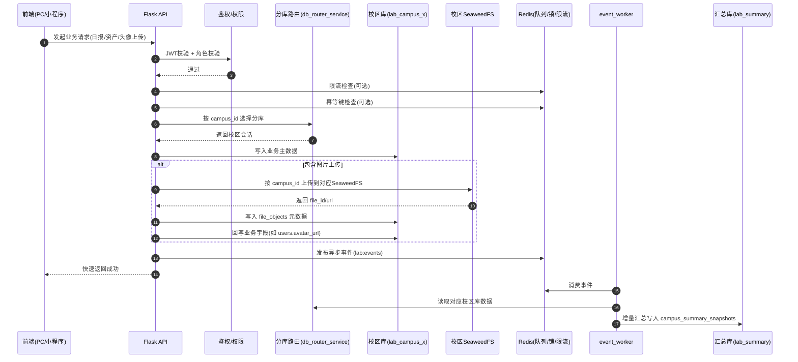
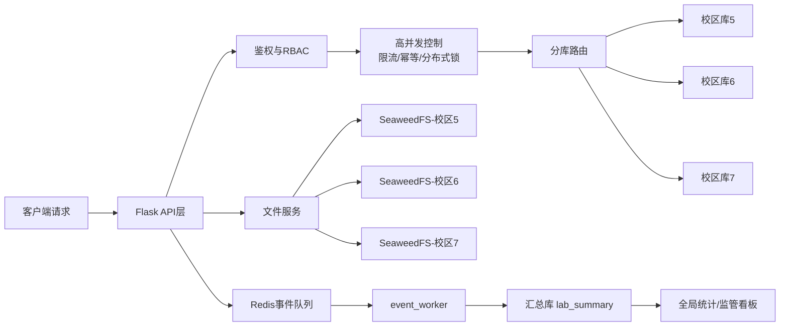
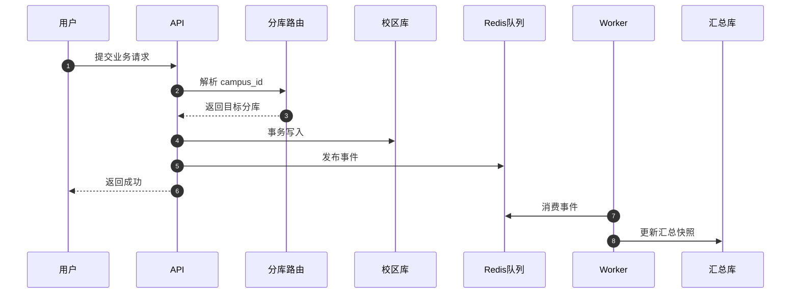
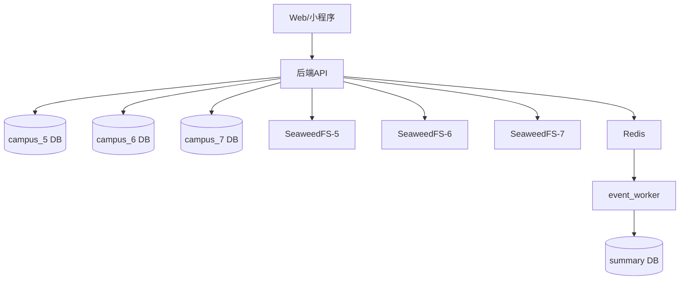

# 后端分布式与高并发图示（论文素材）

> 用途：可直接粘贴到论文第3/4/6章（总体设计、关键机制设计、测试分析）。

## 图1 请求到汇总的端到端时序图

**建议图题**：图4-X 分布式请求处理与异步汇总时序图

---

## 图2 后端总体流程图（分库+分存储+汇总）

**建议图题**：图3-X 系统后端分布式架构流程图

---

## 后续画图模板（写论文时直接套用）

### 1. 业务时序图模板（适合日报、资产、审批）

### 2. 部署拓扑图模板（适合答辩展示）

---

## 使用提醒（后续写论文务必保留）

1. 每一章至少放 1 张“结构图或流程图”，避免纯文字。  
2. 分布式章节优先放“分库路由图 + 多校区部署图”。  
3. 高并发内容放“限流/幂等/异步流程时序图”，穿插在实现处。  
4. 图题统一格式：`图X-Y 名称`，并在正文中先引用再贴图。  
5. 图下方可加 1~2 句说明“本图体现的分布式/并发落点”。  

