# 论文目录（三级标题版）

> 说明：本目录围绕“跨校区协作”和“分布式管理”展开。预约功能作为实验室管理的一部分保留，论文重点放在校区分库、中心汇总、SeaweedFS 分布式文件存储、资产管理、日报上传、Agent 辅助管理以及并发场景下的数据一致性处理上。

---

## 第1章 绪论

### 1.1 研究背景与意义
#### 1.1.1 多校区实验室管理背景
#### 1.1.2 传统实验室管理方式存在的问题
#### 1.1.3 跨校区协作与分布式管理的研究意义

### 1.2 国内外研究现状
#### 1.2.1 实验室管理系统研究现状
#### 1.2.2 分布式系统相关研究现状
#### 1.2.3 高并发业务处理研究现状

### 1.3 研究目标与主要内容
#### 1.3.1 研究目标
#### 1.3.2 主要研究内容
#### 1.3.3 技术路线

**本章图表安排**

| 编号 | 名称 | 放置位置 | 作用 |
|---|---|---|---|
| 图1-1 | 技术路线图 | 1.3.3 | 说明论文从需求分析、系统设计、功能实现到测试验证的整体思路 |
| 表1-1 | 现有问题与解决思路对照表 | 1.2.3 | 说明系统为什么需要引入分布式架构、资产管理和并发控制 |

**图1-1 技术路线图**

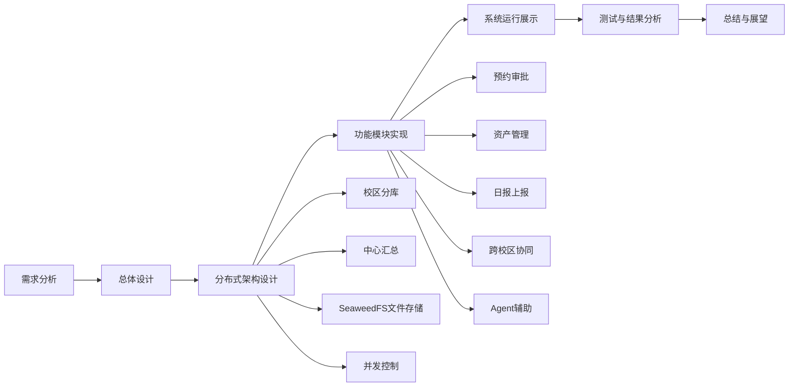

**表1-1 现有问题与解决思路对照表**

| 现有问题 | 本系统解决思路 | 对应章节 |
|---|---|---|
| 多校区数据集中在单一数据库中，后期扩展和维护压力较大 | 按校区划分业务库，并通过中心库进行汇总 | 第3章、第4章 |
| 跨校区数据统计依赖人工整理，实时性和准确性不足 | 设计中心汇总库和异步汇总机制 | 第4章、第5章 |
| 实验室图片、资产照片和日报图片不方便统一管理 | 使用校区级 SeaweedFS 存储图片，并保存文件元数据 | 第4章、第5章 |
| 多人同时提交预约、申报或上传时容易产生重复数据和资源冲突 | 在关键写接口中加入幂等、分布式锁、事务和限流处理 | 第4章、第6章 |
| 资产购置流程缺少额度锁定和审批留痕 | 设计资产申报、预算锁定、审批、入库和台账管理流程 | 第5章 |
| 学生日常实验室情况主要依靠微信发图，不方便归档和审核 | 设计小程序端日报上传和管理员审核模块 | 第5章 |
| 管理员查询和统计依赖人工筛选 | 引入 Agent 辅助查询和流程引导 | 第5章 |

---

## 第2章 相关技术与理论基础

### 2.1 分布式系统相关理论
#### 2.1.1 分布式系统基本概念
#### 2.1.2 强一致性与最终一致性
#### 2.1.3 校区自治与中心汇总思想

### 2.2 高并发处理相关技术
#### 2.2.1 幂等控制
#### 2.2.2 分布式锁与数据库事务
#### 2.2.3 缓存、限流与异步处理

### 2.3 系统相关开发技术
#### 2.3.1 Flask 与前后端分离技术
#### 2.3.2 SeaweedFS 分布式文件存储技术
#### 2.3.3 Agent 辅助查询与流程引导技术

**本章图表安排**

| 编号 | 名称 | 放置位置 | 作用 |
|---|---|---|---|
| 图2-1 | 数据一致性边界图 | 2.1.2 | 区分哪些业务需要强一致，哪些业务可以采用最终一致 |
| 表2-1 | 关键技术选型表 | 2.3.3 | 汇总系统用到的主要技术及其作用 |

**图2-1 数据一致性边界图**

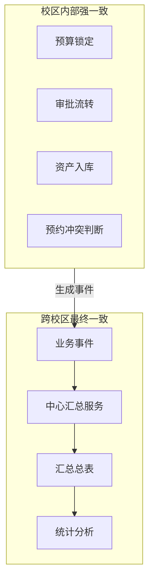

**表2-1 关键技术选型表**

| 技术 | 在系统中的作用 | 选用原因 |
|---|---|---|
| Flask | 提供后端接口服务 | 框架轻量，适合快速实现业务接口 |
| SQLAlchemy | 数据模型和数据库操作 | 便于维护多张业务表和复杂关系 |
| Redis | 分布式锁、缓存、限流 | 读写速度快，支持原子操作 |
| SeaweedFS | 存储资产图片、日报图片和实验室图片附件 | 适合搭建轻量级分布式文件存储服务 |
| 事件队列/事件表 | 支持中心异步汇总 | 可以减少主业务流程等待时间 |
| JWT/RBAC | 登录认证和权限控制 | 适合区分学生、教师、管理员等角色 |
| Agent | 辅助查询和流程引导 | 降低管理员检索和理解数据的成本 |

---

## 第3章 系统需求分析与总体设计

### 3.1 系统需求分析
#### 3.1.1 功能需求分析
#### 3.1.2 非功能需求分析
#### 3.1.3 用户角色与权限需求分析
#### 3.1.4 跨校区协作需求分析

### 3.2 系统总体设计
#### 3.2.1 系统总体架构设计
#### 3.2.2 系统功能模块划分
#### 3.2.3 Web端与小程序端协同设计

### 3.3 数据与部署总体设计
#### 3.3.1 校区分库设计
#### 3.3.2 中心汇总库设计
#### 3.3.3 多校区部署方案设计

**本章图表安排**

| 编号 | 名称 | 放置位置 | 作用 |
|---|---|---|---|
| 图3-1 | 系统总体架构图 | 3.2.1 | 展示客户端、接口服务、校区数据库、文件存储和中心汇总服务之间的关系 |
| 图3-2 | 系统功能模块图 | 3.2.2 | 展示预约、资产、日报、跨校区协同、Agent、统计等功能模块 |
| 图3-3 | 校区数据流转与汇总关系图 | 3.3.2 | 展示各校区业务数据如何进入校区分库，并通过事件同步到中心汇总库 |
| 图3-4 | 多校区部署方案图 | 3.3.3 | 展示不同校区服务、数据库、Redis 和 SeaweedFS 的部署关系 |
| 表3-1 | 功能需求表 | 3.1.1 | 梳理不同角色需要使用的功能 |
| 表3-2 | 非功能需求表 | 3.1.2 | 梳理扩展性、一致性、性能、可用性等要求 |
| 表3-3 | 用户角色权限表 | 3.1.3 | 明确学生、教师、实验室管理员和系统管理员的数据范围 |
| 表3-4 | 跨校区协作需求表 | 3.1.4 | 说明跨校区查看、汇总、监管和权限边界需求 |

**图3-1 系统总体架构图**

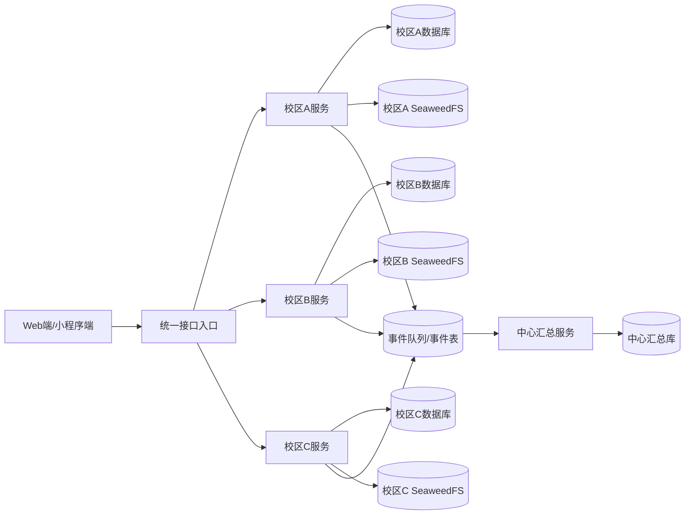

**图3-2 系统功能模块图**

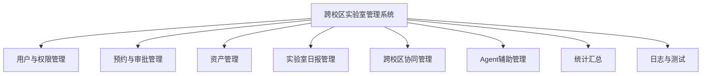

**图3-3 校区数据流转与汇总关系图**

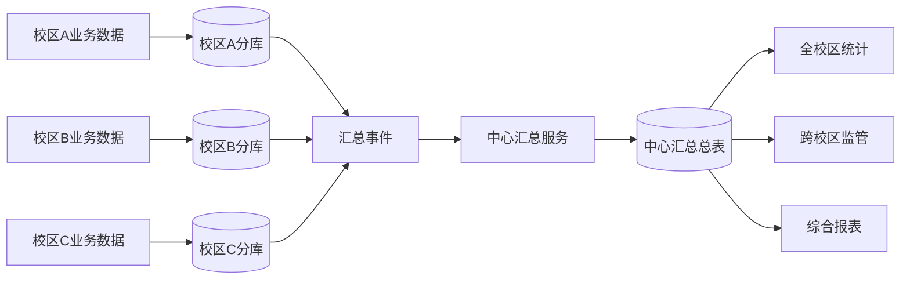

**图3-4 多校区部署方案图**

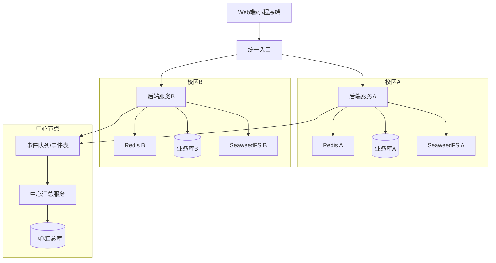

**表3-1 功能需求表**

| 角色/模块 | 功能需求 |
|---|---|
| 学生/教师 | 登录、查看实验室、提交预约、查看个人记录、提交实验室日报 |
| 实验室管理员 | 管理本校区实验室与设备、审批预约、查看和审核日报、处理资产入库 |
| 系统管理员 | 管理校区、用户、全局资源，查看跨校区汇总统计 |
| 资产管理 | 资产申报、预算锁定、审批、入库、图片留档 |
| 跨校区协同 | 校区数据汇总展示、全局统计、跨校区监管 |
| Agent | 管理查询、流程说明、统计辅助 |

**表3-2 非功能需求表**

| 需求类型 | 具体要求 |
|---|---|
| 可扩展性 | 后续可以新增校区、服务实例、数据库和存储节点 |
| 一致性 | 预算锁定、审批流转、预约冲突等关键业务不能出错 |
| 可用性 | 单个校区或部分服务异常时，不影响其他校区的核心使用 |
| 性能 | 高峰期请求量增加时，系统响应时间和错误率保持在可接受范围内 |
| 可维护性 | 模块划分清晰，日志和测试结果能够辅助排查问题 |

**表3-3 用户角色权限表**

| 角色 | 数据范围 | 主要权限 |
|---|---|---|
| 学生 | 本人数据、公开实验室资源 | 预约、日报提交、查看个人记录 |
| 教师 | 本人数据、公开实验室资源 | 预约、日报提交、查看个人记录 |
| 实验室管理员 | 本校区数据 | 实验室管理、设备管理、审批、日报审核 |
| 系统管理员 | 全校区数据 | 用户管理、校区管理、全局统计、跨校区监管 |

**表3-4 跨校区协作需求表**

| 需求类型 | 具体说明 |
|---|---|
| 校区自治 | 各校区管理员主要管理本校区实验室、资产和日报数据 |
| 中心监管 | 系统管理员可以查看跨校区汇总数据和整体运行情况 |
| 数据汇总 | 校区业务数据通过事件方式同步到中心汇总库 |
| 权限隔离 | 普通管理员不能越权查看其他校区明细数据 |
| 统计分析 | 支持按校区、实验室、资产类别等维度进行统计 |

---

## 第4章 分布式架构与关键机制设计

### 4.1 校区分库与数据路由设计
#### 4.1.1 分库规则设计
#### 4.1.2 数据路由流程设计
#### 4.1.3 分库后的权限边界控制

### 4.2 跨校区数据汇总机制设计
#### 4.2.1 跨校区数据汇总流程
#### 4.2.2 汇总总表设计
#### 4.2.3 幂等更新与失败补偿设计

### 4.3 分布式文件存储机制设计
#### 4.3.1 SeaweedFS 存储架构设计
#### 4.3.2 校区级图片与附件存储流程
#### 4.3.3 文件元数据同步与访问控制

### 4.4 高并发业务控制机制设计
#### 4.4.1 重复提交的幂等处理
#### 4.4.2 热点资源的分布式锁控制
#### 4.4.3 缓存、限流与异步处理设计

**本章图表安排**

| 编号 | 名称 | 放置位置 | 作用 |
|---|---|---|---|
| 图4-1 | 数据路由流程图 | 4.1.2 | 说明请求如何根据校区信息访问对应数据库 |
| 图4-2 | 跨校区数据汇总时序图 | 4.2.1 | 说明校区数据如何异步进入中心汇总库 |
| 图4-3 | SeaweedFS 存储架构图 | 4.3.1 | 说明校区级文件存储的基本结构 |
| 图4-4 | 文件上传与元数据同步流程图 | 4.3.2 | 说明图片如何存入校区 SeaweedFS，并同步元数据 |
| 图4-5 | 高并发写入处理流程图 | 4.4.3 | 说明限流、幂等、锁、事务和异步处理的顺序 |
| 表4-1 | 数据一致性策略表 | 4.2.2 | 对比不同业务场景采用的一致性策略 |
| 表4-2 | 文件元数据设计表 | 4.3.3 | 说明文件存储后需要保存的元数据信息 |
| 表4-3 | 并发控制措施表 | 4.4.3 | 说明每种并发控制措施解决的问题 |

**图4-1 数据路由流程图**

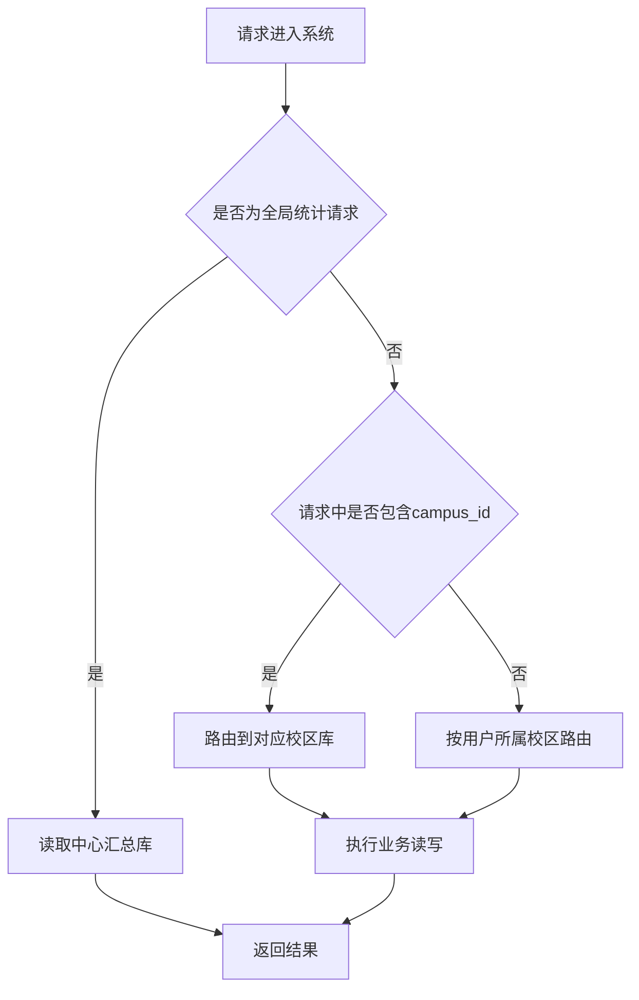

**图4-2 跨校区数据汇总时序图**

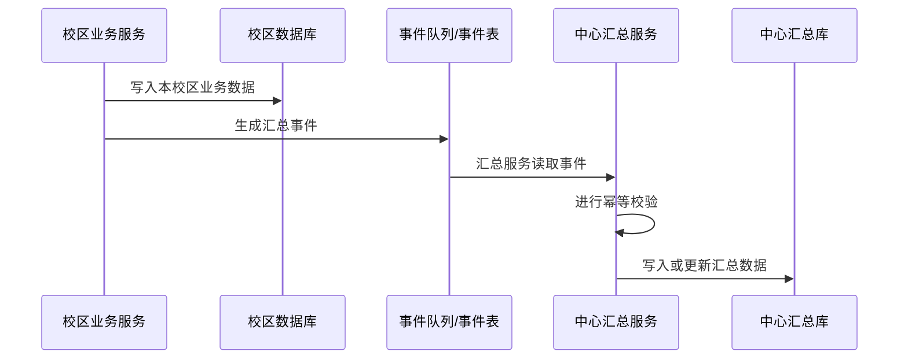

**图4-3 SeaweedFS 存储架构图**

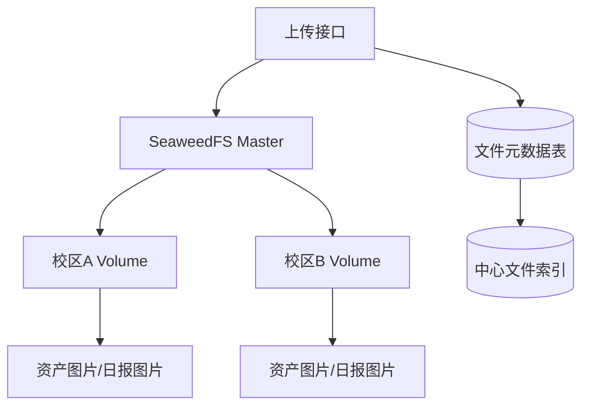

**图4-4 文件上传与元数据同步流程图**

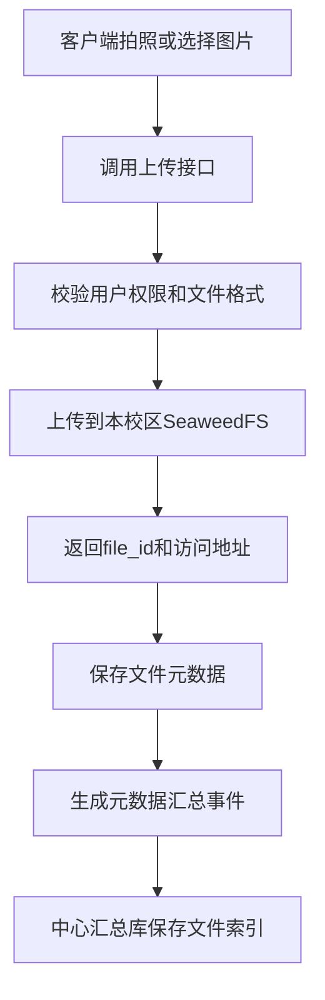

**图4-5 高并发写入处理流程图**

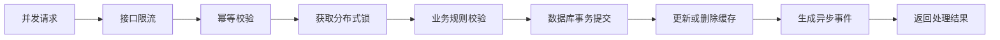

**表4-1 数据一致性策略表**

| 业务场景 | 一致性要求 | 主要实现方式 |
|---|---|---|
| 预算锁定 | 强一致 | 数据库事务、行锁、预算流水 |
| 预约冲突判断 | 强一致 | 分布式锁、时间冲突校验、事务提交 |
| 审批流转 | 强一致 | 状态控制、事务更新 |
| 跨校区汇总 | 最终一致 | 事件投递、幂等消费、失败重试 |
| 图片和附件存储 | 校区本地一致，中心保存元数据 | SeaweedFS 存储文件，数据库保存索引信息 |

**表4-2 文件元数据设计表**

| 字段 | 含义 | 说明 |
|---|---|---|
| `file_id` | 文件唯一标识 | 对应 SeaweedFS 返回的文件标识 |
| `campus_id` | 所属校区 | 用于区分文件存储位置和访问范围 |
| `biz_type` | 业务类型 | 区分资产图片、日报图片、实验室附件等 |
| `biz_id` | 关联业务编号 | 关联资产、日报或实验室记录 |
| `url` | 文件访问地址 | 用于前端展示和管理员查看 |
| `sha256` | 文件摘要 | 用于校验文件完整性和去重 |
| `created_by` | 上传人 | 用于审计和权限判断 |

**表4-3 并发控制措施表**

| 措施 | 使用位置 | 解决的问题 |
|---|---|---|
| 幂等键 | 提交类接口入口 | 防止重复点击或网络重试导致重复写入 |
| 分布式锁 | 预约时段、预算额度等热点资源更新前 | 防止多个请求同时修改同一资源 |
| 数据库事务 | 预算、审批、入库等关键写操作 | 保证相关数据同时成功或同时失败 |
| 缓存 | 实验室列表、设备列表、统计查询等高频读接口 | 减少数据库访问压力 |
| 限流 | 网关或接口层 | 防止短时间大量请求冲击后端服务 |
| 异步事件 | 汇总统计、日志、通知等非核心流程 | 缩短用户等待时间，降低主流程压力 |

---

## 第5章 主要功能模块设计与实现

### 5.1 实验室预约与审批模块设计与实现
#### 5.1.1 预约业务流程
#### 5.1.2 审批业务流程
#### 5.1.3 预约冲突控制实现

### 5.2 资产管理模块设计与实现
#### 5.2.1 资产申报业务模型
#### 5.2.2 预算锁定与审批处理
#### 5.2.3 资产入库与台账管理

### 5.3 实验室日报模块设计与实现
#### 5.3.1 小程序端日报提交流程
#### 5.3.2 管理员端审核流程
#### 5.3.3 日报图片存储与查询

### 5.4 跨校区协同管理模块设计与实现
#### 5.4.1 校区数据汇总展示
#### 5.4.2 全局统计与资源监管
#### 5.4.3 校区自治与系统管理员协同

### 5.5 Agent 辅助管理模块设计与实现
#### 5.5.1 Agent 功能定位
#### 5.5.2 查询问答与流程引导
#### 5.5.3 Agent 在管理场景中的应用

**本章图表安排**

| 编号 | 名称 | 放置位置 | 作用 |
|---|---|---|---|
| 图5-1 | 预约与审批流程图 | 5.1.2 | 展示预约从提交到审批结束的状态变化 |
| 图5-2 | 资产申报与预算锁定流程图 | 5.2.2 | 展示申报、锁额、审批、释放或入库的完整流程 |
| 图5-3 | 实验室日报提交与审核流程图 | 5.3.2 | 展示学生拍照上传和管理员审核的流程 |
| 图5-4 | 跨校区协同管理流程图 | 5.4.2 | 展示校区自治、中心汇总和全局监管之间的关系 |
| 图5-5 | Agent 辅助交互流程图 | 5.5.2 | 展示用户提问、系统查询和结果返回的过程 |
| 表5-1 | 资产管理核心数据表 | 5.2.1 | 展示资产模块涉及的主要数据表 |
| 表5-2 | 日报模块核心数据表 | 5.3.3 | 展示日报和图片元数据相关表 |
| 表5-3 | 跨校区协同管理数据表 | 5.4.1 | 展示中心汇总和全局统计相关数据 |
| 表5-4 | 关键接口设计表 | 5.5.3 | 汇总预约、资产、日报、跨校区协同、Agent 等主要接口 |

**图5-1 预约与审批流程图**

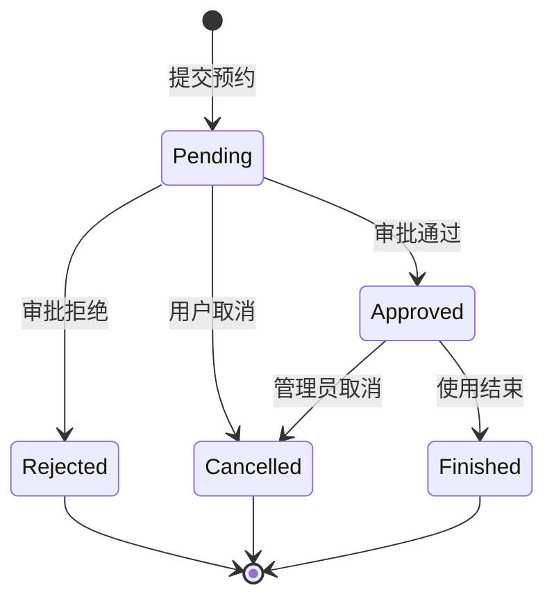

**图5-2 资产申报与预算锁定流程图**

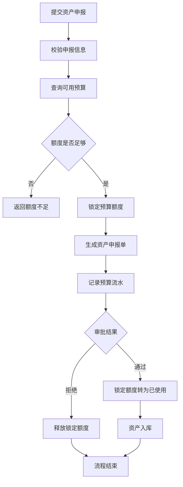

**图5-3 实验室日报提交与审核流程图**

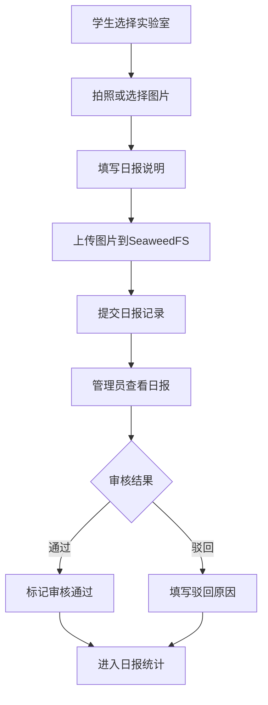

**图5-4 跨校区协同管理流程图**

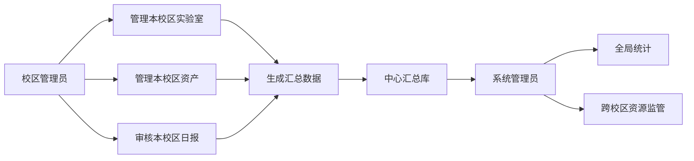

**图5-5 Agent 辅助交互流程图**

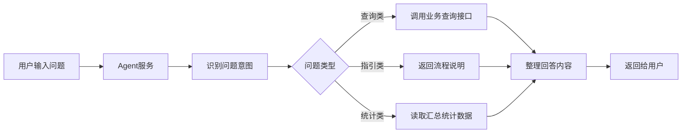

**表5-1 资产管理核心数据表**

| 表名 | 主要字段 | 作用 |
|---|---|---|
| `asset_budget` | `campus_id,total_amount,locked_amount,used_amount` | 保存校区预算额度 |
| `asset_purchase_request` | `request_no,campus_id,amount,status` | 保存资产购置申报单 |
| `asset_budget_ledger` | `request_id,op_type,amount,before,after` | 记录预算锁定、释放和使用流水 |
| `asset_item` | `asset_code,request_id,name,category,price,status` | 保存资产台账信息 |
| `asset_photo` | `asset_id,campus_id,file_id,url,sha256` | 保存资产图片元数据 |

**表5-2 日报模块核心数据表**

| 表名 | 主要字段 | 作用 |
|---|---|---|
| `lab_daily_report` | `campus_id,lab_id,user_id,report_date,status,remark` | 保存日报主记录 |
| `lab_daily_report_photo` | `report_id,file_id,url,sha256,mime_type` | 保存日报图片元数据 |

**表5-3 跨校区协同管理数据表**

| 表名 | 主要字段 | 作用 |
|---|---|---|
| `campus_summary` | `campus_id,lab_count,asset_count,report_count` | 保存校区维度的汇总数据 |
| `global_asset_summary` | `campus_id,category,total_count,total_amount` | 保存跨校区资产统计数据 |
| `global_lab_usage_summary` | `campus_id,lab_id,usage_count,report_count` | 保存实验室使用与日报汇总数据 |
| `sync_event` | `event_id,campus_id,biz_type,status,retry_count` | 保存待汇总事件和补偿状态 |

**表5-4 关键接口设计表**

| 模块 | 接口 | 作用 |
|---|---|---|
| 预约 | `POST /api/reservations` | 提交预约申请 |
| 预约 | `PUT /api/reservations/{id}/approve` | 审批预约 |
| 资产 | `POST /api/asset-requests` | 提交资产购置申报 |
| 资产 | `PUT /api/asset-requests/{id}/approve` | 审批资产申报 |
| 资产 | `POST /api/assets/photos/upload` | 上传资产图片 |
| 日报 | `POST /api/lab-reports` | 提交实验室日报 |
| 日报 | `PUT /api/lab-reports/{id}/review` | 审核实验室日报 |
| 跨校区协同 | `GET /api/global/summary` | 查看跨校区汇总数据 |
| Agent | `POST /api/agent/chat` | Agent 问答和查询 |

---

## 第6章 系统运行与测试分析

### 6.1 系统运行展示
#### 6.1.1 多校区部署运行展示
#### 6.1.2 资产管理流程运行展示
#### 6.1.3 日报上报、审核与图片存储展示
#### 6.1.4 Agent 辅助管理功能展示

### 6.2 测试方案设计
#### 6.2.1 测试环境与工具
#### 6.2.2 测试场景设计
#### 6.2.3 测试指标设计

### 6.3 测试结果与分析
#### 6.3.1 功能测试结果
#### 6.3.2 并发测试结果
#### 6.3.3 分布式存储测试结果
#### 6.3.4 故障恢复测试结果

**本章图表安排**

| 编号 | 名称 | 放置位置 | 作用 |
|---|---|---|---|
| 图6-1 | 多校区部署运行截图 | 6.1.1 | 展示后端服务、数据库和存储服务的运行状态 |
| 图6-2 | 资产管理运行界面截图 | 6.1.2 | 展示资产申报、审批和入库页面 |
| 图6-3 | 日报上报与审核界面截图 | 6.1.3 | 展示小程序拍照上传和管理员审核页面 |
| 图6-4 | SeaweedFS 文件存储运行截图 | 6.1.3 | 展示图片上传后在存储服务和元数据表中的结果 |
| 图6-5 | Agent 辅助问答界面截图 | 6.1.4 | 展示 Agent 查询或流程引导效果 |
| 表6-1 | 测试环境表 | 6.2.1 | 说明测试使用的服务、数据库、缓存、存储和工具 |
| 表6-2 | 测试场景表 | 6.2.2 | 说明功能、并发、存储和故障恢复测试场景 |
| 表6-3 | 功能测试结果表 | 6.3.1 | 展示主要业务流程是否通过 |
| 表6-4 | 并发测试结果表 | 6.3.2 | 展示请求量、响应时间、错误率等指标 |
| 表6-5 | 分布式存储测试结果表 | 6.3.3 | 展示图片上传、访问、元数据同步等测试结果 |
| 表6-6 | 故障恢复测试结果表 | 6.3.4 | 展示服务异常后系统恢复情况 |

**表6-1 测试环境表**

| 项目 | 配置 |
|---|---|
| 后端服务 | Flask 多实例 |
| 数据库 | MySQL/校区分库 |
| 缓存与锁 | Redis |
| 文件存储 | SeaweedFS |
| 网关 | Nginx/统一接口入口 |
| 压测工具 | 自定义并发脚本或压测工具 |

**表6-2 测试场景表**

| 场景编号 | 测试场景 | 验证目标 |
|---|---|---|
| T1 | 多用户并发提交资产申报 | 验证预算锁定不会超额 |
| T2 | 同一请求重复提交 | 验证幂等机制是否生效 |
| T3 | 日报图片上传 | 验证图片存储和元数据保存是否一致 |
| T4 | 跨校区汇总展示 | 验证中心汇总数据是否正确 |
| T5 | 汇总服务中断后恢复 | 验证中心汇总是否可以补偿完成 |
| T6 | 单个服务节点停止 | 验证系统基本可用性 |

**表6-3 功能测试结果表**

| 测试项 | 预期结果 | 测试结果 |
|---|---|---|
| 预约提交与审批 | 状态流转正确 | 待补充 |
| 资产申报与审批 | 预算锁定和释放正确 | 待补充 |
| 资产入库 | 台账和图片元数据正确 | 待补充 |
| 日报提交与审核 | 日报状态流转正确 | 待补充 |
| 跨校区汇总展示 | 汇总数据按校区正确展示 | 待补充 |
| Agent 查询 | 返回符合权限范围的数据 | 待补充 |

**表6-4 并发测试结果表**

| 场景 | 并发数 | 总请求数 | QPS | 平均响应时间(ms) | P95(ms) | 错误率 | 说明 |
|---|---:|---:|---:|---:|---:|---:|---|
| 资产并发申报 | 待补充 | 待补充 | 待补充 | 待补充 | 待补充 | 待补充 | 验证预算是否超额 |
| 重复提交请求 | 待补充 | 待补充 | 待补充 | 待补充 | 待补充 | 待补充 | 验证幂等处理 |
| 日报图片上传 | 待补充 | 待补充 | 待补充 | 待补充 | 待补充 | 待补充 | 验证上传稳定性 |

**表6-5 分布式存储测试结果表**

| 测试项 | 预期结果 | 测试结果 |
|---|---|---|
| 资产图片上传 | 文件保存到对应校区 SeaweedFS，元数据写入数据库 | 待补充 |
| 日报图片上传 | 图片可正常访问，日报记录与图片关联正确 | 待补充 |
| 文件元数据同步 | 中心汇总库能查询到文件索引 | 待补充 |
| 文件访问权限 | 非授权用户不能访问无权限文件 | 待补充 |

**表6-6 故障恢复测试结果表**

| 故障类型 | 注入方式 | 预期结果 | 测试结果 |
|---|---|---|---|
| 后端服务实例停止 | 停止一个后端实例 | 其他实例继续提供服务 | 待补充 |
| 汇总服务中断 | 停止汇总任务 | 恢复后继续处理未汇总数据 | 待补充 |
| SeaweedFS 短暂不可用 | 停止对象存储服务 | 上传失败时给出提示或重试 | 待补充 |
| Redis 不可用 | 停止 Redis | 涉及锁和限流的接口保护性失败 | 待补充 |

---

## 第7章 总结与展望

### 7.1 研究工作总结
#### 7.1.1 系统设计工作总结
#### 7.1.2 功能实现工作总结
#### 7.1.3 分布式与并发机制总结
#### 7.1.4 测试验证结果总结

### 7.2 后续工作展望
#### 7.2.1 数据实时汇总能力优化
#### 7.2.2 跨校区容灾能力优化
#### 7.2.3 Agent 辅助管理能力优化

**本章图表安排**

| 编号 | 名称 | 放置位置 | 作用 |
|---|---|---|---|
| 表7-1 | 主要工作总结表 | 7.1.2 | 汇总分布式架构、资产管理、日报上报、跨校区协同、Agent 和测试方面的工作 |
| 表7-2 | 后续工作展望表 | 7.2.3 | 说明后续可以继续完善的方向 |

**表7-1 主要工作总结表**

| 工作内容 | 完成情况 |
|---|---|
| 分布式架构设计 | 完成校区分库、校区自治和中心汇总设计 |
| 分布式文件存储 | 完成 SeaweedFS 图片和附件存储方案设计 |
| 资产管理 | 完成资产申报、预算锁定、审批和入库设计 |
| 日报上报 | 完成小程序端上传和管理员审核设计 |
| 跨校区协同 | 完成校区汇总展示、全局统计和资源监管设计 |
| Agent 辅助 | 完成查询问答和流程引导设计 |
| 测试验证 | 完成功能测试、并发测试、存储测试和故障恢复测试方案设计 |

**表7-2 后续工作展望表**

| 方向 | 内容 |
|---|---|
| 数据实时汇总 | 后续可以引入 CDC 或流式任务，提高中心汇总实时性 |
| 跨校区容灾 | 后续可以继续完善跨校区故障切换和数据备份机制 |
| 文件存储治理 | 后续可以增加文件生命周期管理、权限控制和容量监控 |
| Agent 能力增强 | 后续可以扩展统计解释、流程推荐和异常提醒能力 |
