# 支持跨校区协作的分布式实验室管理系统设计与实现

## 摘要

随着高校多校区办学和实验教学规模扩大，实验室资源在空间分布、开放时间、设备状态和预约审批等方面呈现出更高的管理复杂度。传统依赖线下登记、人工沟通和分散表格维护的方式，容易产生预约效率低、跨校区资源协同不足、审批流程分散和统计困难等问题。针对上述问题，本文设计并实现了一个支持跨校区协作的分布式实验室管理系统。系统采用前后端分离和分层架构设计，后端基于 Flask 构建 RESTful API 服务，使用 SQLAlchemy 完成数据建模，结合 JWT 和角色权限控制实现身份认证、权限校验和校区级数据范围控制；前端提供 Web 端和微信小程序端，满足管理员和普通用户的多端访问需求。系统实现了用户管理、校区管理、实验室管理、设备管理、预约冲突检测、审批流转、统计分析和操作记录等功能，并设计了面向实验室预约场景的 Agent 智能助手，支持通过自然语言查询个人预约、可预约实验室、实验室排期和统计概况。测试结果表明，系统能够支撑多角色、多校区、多终端的实验室预约与管理需求，有助于提高实验室资源利用率、预约审批规范性和管理数据可追踪性。

关键词：实验室管理；跨校区协作；预约系统；权限控制；智能助手

## Abstract

With the expansion of multi-campus university operation and experimental teaching, laboratory resources present higher management complexity in terms of spatial distribution, opening hours, equipment status and reservation approval. Traditional methods relying on offline registration, manual communication and scattered spreadsheets are prone to low reservation efficiency, insufficient cross-campus resource collaboration, decentralized approval processes and difficulty in statistical analysis. To address these problems, this thesis designs and implements a distributed laboratory management system supporting cross-campus collaboration. The system adopts a front-end and back-end separated architecture with layered design. The back end uses Flask to build RESTful API services, SQLAlchemy for data modeling, and JWT combined with role-based access control to implement authentication, permission verification and campus-level data scope control; the front end provides a Web client and a WeChat Mini Program client to meet the multi-terminal access needs of administrators and general users. The system implements user management, campus management, laboratory management, equipment management, reservation conflict detection, approval workflow, statistical analysis and operation logs. It also designs an Agent-based intelligent assistant for laboratory reservation scenarios, supporting natural language queries for personal reservations, available laboratories, laboratory schedules and statistical overviews. Test results show that the system can support multi-role, multi-campus and multi-terminal laboratory reservation and management requirements, helping improve laboratory resource utilization, reservation approval standardization and management data traceability.

Keywords: laboratory management; cross-campus collaboration; reservation system; access control; intelligent assistant

## 第1章 绪论

### 1.1 课题背景与研究意义

#### 1.1.1 高校实验室信息化背景

随着高等教育信息化建设持续推进，高校教学资源的组织方式、管理方式和服务方式正在从传统线下管理逐步转向数字化、网络化和智能化。《教育信息化 2.0 行动计划》强调，要以信息技术推动教育资源共享、教育治理能力提升和教育服务模式创新[1]。实验室作为高校实践教学、科研训练和创新能力培养的重要载体，其管理水平直接影响实验教学质量、设备资源利用率以及校园治理效率。近年来，教育部陆续发布高校实验室安全规范和实验室消防安全管理规范，对高校实验室制度建设、安全管理、责任落实和信息化管理提出了更高要求[2][3]。因此，建设规范、高效、可追踪的实验室管理系统，已经成为高校教学管理信息化中的重要内容。

#### 1.1.2 多校区实验室管理问题

在多校区办学背景下，实验室管理问题更加复杂。不同校区之间往往存在实验室类型不同、设备配置不均衡、开放时间不一致、管理人员分散、使用群体多样等情况。传统依靠线下登记、人工沟通和表格统计的管理方式，容易导致实验室开放信息不透明、预约冲突难以及时发现、审批流程分散、资源利用情况缺乏统计依据等问题。已有研究表明，实验室预约管理系统能够通过在线预约、信息查询、审批管理和数据统计提升实验室管理效率与规范化水平[4]；基于低代码平台的实验室预约系统研究也说明，信息化手段能够减少人工操作成本，并提高实验室及设备资源利用率[5]。然而，对于跨校区协作场景而言，仅实现单一校区的预约登记还不足以解决资源共享、权限隔离和多端访问等综合问题。

#### 1.1.3 系统建设目标与研究意义

本课题围绕“支持跨校区协作的分布式实验室管理系统”展开设计与实现，旨在将校区、实验室、设备、用户、预约、审批、统计和智能问答等业务整合到统一平台中。系统面向学生、教师、实验室管理员和系统管理员等不同角色，提供 Web 管理端、H5 访问端和微信小程序端，并通过统一后端服务实现多端业务复用。在此基础上，本文进一步设计面向实验室预约场景的 Agent 智能助手模块，使用户能够通过自然语言完成预约查询、实验室排期查询、可预约资源查询和页面跳转引导等操作，从而改善传统管理系统“功能多但入口分散”的使用体验。

本课题的研究意义主要体现在以下三个方面。第一，在应用层面，系统能够集中管理多校区实验室资源和预约业务，降低师生查询与预约成本，减少实验室管理员的重复沟通和人工统计工作。第二，在管理层面，系统通过角色权限控制、校区数据范围限制、预约冲突检测、审批流转和操作记录，提高实验室使用过程的规范性、可追踪性和可审计性。第三，在技术层面，系统采用“统一后端 API + 多端前端访问 + 规则驱动 Agent + 可扩展 LLM 接入”的架构，将跨校区资源协同、权限控制、业务工具调用和自然语言交互结合起来，为高校实验室管理系统的数字化和智能化改造提供一种可实现的工程方案。

### 1.2 国内外研究现状

#### 1.2.1 国外实验室预约与共享调度研究

国外关于实验室开放管理、资源预约和共享调度的研究开展较早。Ma 针对高校开放实验室和实验室预约系统进行研究，指出移动端预约方式能够帮助教师和学生更便捷地查询实验室资源并提交预约申请，从而提升实验室开放管理效率[6]。Khazri 等面向远程实验室提出预约系统与排队机制，强调在共享实验资源场景下，需要通过合理的预约调度和排队策略降低用户等待时间，提高实验资源利用率[7]。Wang 等从高校实验设备预约管理角度提出基于 B/S 架构的系统方案，说明模块化设计和流程化管理有助于提升实验室设备预约管理的标准化水平[8]。Zhu 等则在实验室预约管理系统中引入 RFID 技术，用于加强实验室使用过程中的实时监测和自动化管理[9]。这些研究为实验室预约、设备管理和自动化监测提供了有益参考。

#### 1.2.2 智慧校园相关研究

智慧校园相关研究为实验室管理系统提供了更广阔的理论和应用背景。Li 从物联网角度设计智慧校园管理系统，提出通过统一数据采集、设备互联和后台管理提高校园运行管理质量[10]。Zhang 等对智慧校园技术与应用进行了系统综述，认为智慧校园是教育系统智能化发展的重要形态，涉及教学、管理、服务、能源和安全等多个领域[11]。从这一角度看，实验室管理系统不应仅被视为单一的预约工具，而应作为智慧校园资源治理体系的一部分，与校园数据管理、权限控制、设备状态监测和用户服务体验相结合。

#### 1.2.3 国内实验室管理系统研究

国内关于高校实验室管理系统的研究主要集中在预约管理、资源管理、前后端分离系统实现和综合信息管理等方面。李丹设计的基于 B/S 的高校实验室预约管理系统支持实验室、教室和会议室预约，并与统一身份认证系统进行对接，有助于提高实验室管理规范性[4]。杨萍萍、白艳茹基于低代码平台实现高校实验室预约系统，为实验室开放预约和资源利用率提升提供了实践案例[5]。王以伍、舒晖基于 SpringBoot 与 Vue 实现高校实验室预约管理系统，说明前后端分离模式能够降低界面展示与业务逻辑之间的耦合，提高系统维护性[14]。黄孝新等从功能分析角度指出，高校实验室管理系统应围绕实验室排课、开放预约、用户权限和数据权限等实际业务进行设计[15]。赵亮等、吴荻等分别从 JavaWeb 系统实现和综合信息管理角度探讨实验室资源、用户和业务流程的信息化组织方式，为本文的数据模型设计和资源管理模块实现提供了参考[16][17]。

#### 1.2.4 智能化与平台化管理研究

在实验室智能化和平台化管理方面，相关研究也在不断推进。苏泽荫等提出基于物联网平台的高校实验室管理系统，通过传感器采集、远程控制和异常处理提升实验室运行管理能力[18]。陈志聪、洪小坚从云技术角度讨论实验室管理系统的设计与实现，为系统后续云端部署、资源弹性扩展和集中运维提供了参考[19]。与此同时，随着大语言模型和智能体技术的发展，Agent 逐渐被应用于任务规划、工具调用和人机交互场景。ReAct 方法提出将推理与行动结合，使模型能够在任务执行过程中调用外部工具并生成中间推理过程[20]；大语言模型智能体综述则进一步总结了 LLM Agent 在感知、规划、记忆和工具使用等方面的研究进展[21]。这些研究为本文设计面向实验室预约业务的 Agent 智能助手提供了方法依据。

#### 1.2.5 现有研究不足

综上所述，现有研究已经在实验室预约、设备管理、前后端分离、物联网监测和智慧校园建设等方面形成了一定基础，但仍存在进一步改进空间。第一，部分系统主要面向单校区或单实验中心，针对跨校区资源协作、校区级数据范围控制和多校区统计分析的设计不足。第二，部分研究重视功能页面实现，但对预约冲突检测、审批状态流转、角色权限边界和操作可追踪性等核心业务规则论述不够深入。第三，智慧校园和智能体技术虽然发展迅速，但与高校实验室预约业务的结合仍不充分，尤其缺少面向真实业务数据和权限约束的智能辅助设计。因此，本文在已有研究基础上，围绕跨校区协作场景设计并实现一个集资源管理、预约审批、统计分析和 Agent 智能助手于一体的分布式实验室管理系统。

### 1.3 研究内容

本文围绕“支持跨校区协作的分布式实验室管理系统”开展研究，结合高校多校区实验室管理中的资源分散、预约冲突、审批分散、统计不足和多端访问需求，完成系统需求分析、总体设计、功能实现和测试验证。主要研究内容如下。

1. 跨校区实验室资源模型设计。围绕校区、实验室、设备、用户、预约、审批和操作日志等核心对象建立数据模型，实现实验室资源的统一组织、跨校区查询和校区级管理。
2. 多角色权限与数据范围控制设计。结合学生、教师、实验室管理员和系统管理员四类用户角色，明确不同角色在资源查看、预约提交、审批管理、用户维护和统计分析中的权限边界，并通过 JWT 与 RBAC 思想实现身份认证和权限控制[12][13]。
3. 预约与审批业务规则实现。围绕实验室预约场景，实现预约日期校验、开放时间校验、容量限制、预约冲突检测、预约取消、审批通过与拒绝等核心业务逻辑，保证预约流程的规范性和一致性。
4. 多端协同访问实现。系统提供 Web/H5 管理端和微信小程序端，前端通过统一 API 调用后端服务，使管理端和移动端能够复用同一套业务规则。
5. 统计分析与运行效果展示。系统提供总览统计、校区维度统计、实验室利用率统计和预约状态统计，为实验室资源优化配置和管理决策提供数据支持。
6. Agent 智能助手模块设计。针对传统管理系统入口分散、查询路径较长的问题，设计面向实验室预约场景的 Agent 智能助手，支持自然语言查询个人预约、可预约实验室、实验室排期和统计概况，并通过工具调用返回结构化结果和页面跳转动作。

### 1.4 技术路线

#### 1.4.1 后端分层与数据访问

系统采用前后端分离与分层架构设计。后端基于 Flask 框架构建 RESTful API 服务，使用 SQLAlchemy 完成对象关系映射，支持 SQLite 开发环境和 MySQL 生产环境。系统后端按照 API 层、Service 层、Model 层和 Utils 层进行组织，其中 API 层负责路由定义和请求参数接收，Service 层集中处理预约冲突、审批流转、统计聚合和 Agent 业务逻辑，Model 层负责数据库模型定义，Utils 层提供统一响应、异常处理、字段校验和权限装饰器等通用能力。

#### 1.4.2 身份认证与权限控制

在身份认证与权限控制方面，系统采用 JWT 机制实现无状态登录鉴权。JWT 标准提供了一种紧凑的声明传递方式，适合前后端分离系统中的用户身份认证场景[12]。同时，系统结合 RBAC 模型对用户角色和接口访问权限进行控制，保证学生、教师、实验室管理员和系统管理员只能访问其权限范围内的数据与功能[13]。对于实验室管理员，系统进一步限制其只能管理本校区实验室、设备和预约数据，从而满足跨校区协作场景下的数据边界要求。

#### 1.4.3 多端协同访问

前端部分采用 uni-app 实现 Web/H5 端界面，微信小程序端采用原生小程序技术实现移动端访问。Web/H5 端主要服务于系统管理员和实验室管理员，用于资源维护、预约审批和统计分析；微信小程序端主要服务于学生和教师，用于浏览校区与实验室信息、提交预约、查看个人预约和使用智能助手。两端均通过统一 API 调用后端服务，保证业务规则集中在后端 Service 层，避免多端重复实现导致逻辑不一致。

#### 1.4.4 Agent 智能助手技术路线

Agent 智能助手模块采用“规则模式为主、LLM 扩展为辅”的设计思路。规则模式下，系统通过关键词识别、日期解析和工具调用实现个人预约查询、可预约实验室查询、实验室排期查询和统计概况查询；在配置外部大模型服务后，可进一步增强自然语言理解和回复表达能力。Agent 模块并不绕过系统原有业务逻辑，而是复用已有 Service、Model 和权限控制机制，从而保证智能助手返回内容与系统真实数据一致，也避免普通用户通过自然语言查询越权获取管理数据。

### 1.5 论文组织结构

全文共分为八章，各章内容安排如下。

第1章为绪论，主要介绍课题背景与研究意义，分析国内外实验室预约管理、智慧校园和 Agent 智能助手相关研究现状，明确本文研究内容、技术路线和论文结构。

第2章为需求分析，围绕跨校区实验室管理场景，分析系统业务痛点、用户角色、功能需求、非功能需求和可行性，为后续系统设计提供依据。

第3章为系统总体设计，说明系统总体架构、分层结构、核心业务流程、权限安全机制和数据库设计，明确系统各模块之间的关系。

第4章为关键模块设计与实现，重点阐述用户认证与权限管理、校区/实验室/设备管理、预约与审批、统计分析和前后端接口交互等核心功能。

第5章为 Agent 智能助手模块设计与实现，围绕智能助手的设计目标、总体架构、意图识别、工具调用、LLM 扩展模式和前端交互效果展开论述，突出本文的创新点。

第6章为系统测试与结果分析，设计功能测试、权限测试、边界测试、Agent 模块测试和稳定性测试，并对测试结果进行分析。

第7章为系统运行展示与应用效果，说明系统主要页面运行效果，并从效率、规范性、可追踪性和跨端便利性等方面分析系统应用价值。

第8章为总结与展望，总结本文完成的主要工作和创新点，分析系统仍存在的不足，并提出后续优化方向。

## 第2章 需求分析

### 2.1 业务场景与痛点

#### 2.1.1 多校区业务背景

高校实验室是实践教学、科研训练和创新活动的重要场所，其管理内容通常涉及实验室开放时间、设备状态、预约申请、审批记录、安全规范和使用统计等多个方面。随着高校多校区办学模式的发展，实验室资源不再集中于单一空间，不同校区之间在实验室类型、设备数量、开放时段、管理人员和服务对象方面存在差异，资源查询、预约协调和统计管理的复杂度明显提升。教育信息化和实验室安全管理相关政策也要求高校不断提升实验室管理的规范化、信息化和可追踪水平[1][2][3]。

#### 2.1.2 传统管理方式痛点

在传统管理方式下，实验室预约往往依赖线下登记、人工沟通或分散表格维护。该方式在小规模场景中能够满足基本记录需求，但在多校区、多角色、多实验室并行使用的场景下，容易出现以下问题。第一，实验室开放信息分散，师生难以及时了解不同校区实验室的可用状态和设备情况。第二，人工预约和审批效率较低，容易出现重复预约、审批延迟和信息遗漏。第三，实验室管理员需要同时维护实验室、设备、预约、审批和安全相关信息，工作量较大且缺乏统一追踪手段。第四，管理人员需要在资源共享和权限边界之间取得平衡，既要支持跨校区查询，又要避免普通用户或非本校区管理员越权操作。已有实验室预约管理系统研究表明，在线预约、审批管理和数据统计能够提升实验室管理效率与规范性[4][5][14]，但对于跨校区协作场景，还需要进一步关注数据范围控制、多端访问和智能化交互问题。

#### 2.1.3 系统业务目标

基于上述业务背景，本文系统需要面向学生、教师、实验室管理员和系统管理员等不同用户，提供统一的实验室资源管理、预约申请、审批流转、统计分析和智能辅助能力。系统既要满足管理员在 Web 端集中维护资源和处理审批的需求，也要满足学生、教师在微信小程序端快速查询实验室、提交预约和查看个人预约的需求。同时，为降低用户查找功能和查询资源的操作成本，系统还需要提供面向实验室预约场景的 Agent 智能助手，使用户能够通过自然语言完成常见业务查询。

#### 2.1.4 主要业务用例

为了更直观地说明不同角色与系统功能之间的对应关系，本文将主要业务用例抽象为图2-1。由图可见，学生和教师主要使用实验室查询、预约申请、个人预约管理和 Agent 智能助手等功能；实验室管理员主要负责本校区资源维护、预约审批和统计查看；系统管理员负责全局用户、校区、实验室、设备和统计管理。

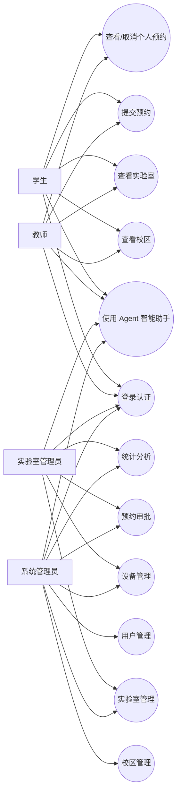

图2-1 系统业务用例图

### 2.2 角色与权限需求

#### 2.2.1 权限划分原则

系统采用基于角色的权限划分方式，将用户分为学生、教师、实验室管理员和系统管理员四类。不同角色在系统中的业务目标和权限范围不同，系统需要通过登录认证、角色判断和数据范围控制保证各类用户只能访问其权限范围内的功能与数据。JWT 能够为前后端分离系统提供无状态身份认证机制[12]，RBAC 模型则为用户、角色和权限之间的映射关系提供了理论基础[13]。

#### 2.2.2 普通用户权限

学生角色主要面向实验学习和实践训练场景，其需求包括登录系统、查看校区列表、浏览实验室信息、查看实验室开放时间和设备状态、提交预约申请、查看个人预约记录、取消未完成预约以及使用 Agent 智能助手查询个人预约和可预约实验室。学生只能查看和管理自己的预约记录，不能访问管理端资源维护和审批功能。

教师角色除具备普通预约能力外，还可能面向课程实验、教学活动和科研实践场景提交实验室预约。教师可查看实验室资源、提交预约申请、查看个人预约记录，并通过系统了解预约审批状态。教师与学生一样，不能越权查看其他用户预约详情，也不能直接维护实验室或设备基础数据。

#### 2.2.3 管理员权限

实验室管理员角色主要负责本校区实验室和设备管理。该角色可以维护本校区实验室信息、管理实验室设备、查看本校区预约记录、处理本校区待审批预约，并查看本校区相关统计数据。由于系统面向跨校区协作，实验室管理员的数据权限需要受到校区范围限制，即只能管理其所属校区的数据，不能修改其他校区实验室、设备或预约信息。

系统管理员角色拥有全局管理权限，负责维护所有校区、用户、实验室和设备信息，可查看系统级统计数据，并对跨校区资源进行统一管理。系统管理员还可以进行用户创建、角色分配、密码重置和基础数据维护，是系统运行维护中的最高权限角色。

为了将上述角色差异进一步落实到权限设计中，表2-1 对各类用户的主要使用场景和核心权限进行了归纳。

表2-1 用户角色与权限需求表

| 角色 | 主要使用场景 | 核心权限 |
| --- | --- | --- |
| 学生 | 实验学习、实践训练、个人预约 | 登录、查看校区与实验室、提交预约、查看和取消个人预约、使用 Agent |
| 教师 | 教学实验、科研实践、课程相关预约 | 登录、查询实验室资源、提交预约、查看个人预约、使用 Agent |
| 实验室管理员 | 本校区资源维护、预约审批、统计查看 | 管理本校区实验室和设备、审批本校区预约、查看本校区统计 |
| 系统管理员 | 全局系统维护、跨校区资源管理 | 管理全部校区、用户、实验室、设备、预约审批和系统统计 |

### 2.3 功能需求

#### 2.3.1 功能模块划分

结合项目业务场景，系统功能需求可划分为用户认证与个人资料管理、校区管理、实验室管理、设备管理、预约管理、审批管理、统计分析和 Agent 智能助手等模块。

在明确用户角色和权限边界后，系统功能需求可以按照业务模块进行拆分。表2-2 从功能模块、功能说明和使用角色三个方面对系统主要功能进行整理，为后续系统设计和模块实现提供依据。

表2-2 功能需求表

| 功能模块 | 功能说明 | 使用角色 |
| --- | --- | --- |
| 用户认证与个人资料管理 | 登录认证、身份校验、个人资料维护、头像上传 | 全部用户 |
| 校区管理 | 校区新增、编辑、删除、查询和封面维护 | 系统管理员、普通用户 |
| 实验室管理 | 实验室新增、编辑、删除、查询、开放时间和图片维护 | 系统管理员、实验室管理员、普通用户 |
| 设备管理 | 设备新增、编辑、状态维护和设备查询 | 系统管理员、实验室管理员 |
| 预约管理 | 预约提交、冲突检测、预约取消和个人预约查询 | 学生、教师、管理员 |
| 审批管理 | 预约通过、拒绝和审批意见记录 | 系统管理员、实验室管理员 |
| 统计分析 | 总览统计、校区统计、实验室利用率统计 | 系统管理员、实验室管理员 |
| Agent 智能助手 | 自然语言查询预约、排期、可预约实验室和统计概况 | 全部用户 |

#### 2.3.2 资源管理类功能

用户认证与个人资料管理模块用于完成用户登录、身份校验、个人信息查看与修改、头像上传等功能。用户登录后，系统根据其角色返回对应权限和可访问入口，前端在后续请求中携带 token 完成接口鉴权。该模块是系统权限控制和数据安全的基础。

校区管理模块用于维护多校区基础信息，包括校区名称、地址、简介、封面图和状态等。系统管理员可以新增、修改和删除校区信息，普通用户可以查看校区列表和校区详情。该模块为跨校区实验室资源组织提供基础数据支撑。

实验室管理模块用于维护实验室基础信息，包括所属校区、实验室名称、位置、容量、开放时间、关闭时间、状态、简介和实验室图片等。管理员可以对实验室进行新增、修改、删除和图片上传操作；普通用户可以浏览实验室列表、查看实验室详情和开放状态。该模块需要与校区数据关联，确保实验室资源能够按照校区维度统一管理。

设备管理模块用于维护实验室内设备信息，包括设备名称、所属实验室、数量、状态和说明等。实验室管理员只能管理本校区实验室下的设备，系统管理员可以跨校区管理设备。设备状态信息能够辅助用户判断实验室资源是否满足预约需求，也为后续物联网设备状态监测扩展提供基础[18][19]。

#### 2.3.3 预约与审批功能

预约管理模块是系统的核心功能之一。用户提交预约时，系统需要校验预约校区与实验室所属校区是否一致、预约日期和时间是否合法、预约时段是否处于实验室开放时间内、预约人数是否超过实验室容量，并检测该时间段是否与已有待审批或已通过预约发生冲突。学生和教师提交预约后默认进入待审批状态，管理员发起的预约可根据业务规则自动通过。预约调度和冲突处理是提升实验室资源利用率的重要基础[6][7][8]。

由于预约管理直接关系到实验室资源是否会出现时间冲突和容量超限等问题，本文将预约提交阶段需要重点处理的业务规则整理为表2-3。通过这些规则，系统能够在预约提交阶段尽量拦截无效预约和冲突预约，保证实验室资源使用的有序性。

表2-3 预约业务规则表

| 规则编号 | 规则内容 | 处理方式 |
| --- | --- | --- |
| R1 | 必填字段不能为空 | 缺失时返回错误提示 |
| R2 | 实验室必须存在且状态可用 | 不满足则禁止预约 |
| R3 | 预约校区必须与实验室所属校区一致 | 不一致则返回校区不匹配 |
| R4 | 开始时间必须早于结束时间 | 不满足则返回时间错误 |
| R5 | 预约时间必须在实验室开放时间内 | 不满足则拒绝预约 |
| R6 | 预约人数不能超过实验室容量 | 超出则返回容量超限 |
| R7 | 不能与已有待审批或已通过预约冲突 | 冲突则拒绝提交 |
| R8 | 学生和教师预约默认待审批 | 创建 pending 状态预约 |
| R9 | 管理员预约可自动通过 | 创建 approved 状态预约 |

在上述业务规则的基础上，预约需求处理过程可以进一步抽象为图2-2。用户提交预约后，系统会依次完成字段校验、实验室状态校验、校区匹配校验、时间校验、容量校验和冲突检测，最后根据用户角色生成待审批或已通过的预约记录。该流程体现了系统在预约入口处进行前置校验的设计思路。

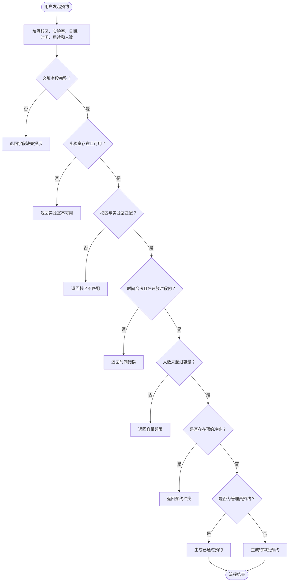

图2-2 预约需求流程图

审批管理模块用于处理预约申请。实验室管理员可以审批本校区预约，系统管理员可以处理全部校区预约。审批操作包括通过和拒绝，并可填写审批意见。审批结果需要同步更新预约状态，并记录相关操作日志，便于后续追踪和审计。

#### 2.3.4 统计分析与智能辅助功能

统计分析模块用于提供系统运行数据，包括总览统计、校区维度统计、实验室利用率统计和预约状态统计等。管理员可通过统计数据了解实验室资源数量、预约数量、审批状态和资源利用情况，为资源优化和管理决策提供依据。相关研究表明，数据统计和可视化能力是实验室管理系统提升管理效率的重要组成部分[4][5][17]。

Agent 智能助手模块用于提升系统交互效率。用户可以通过自然语言询问“我的预约”“明天有哪些实验室可以预约”“某实验室今天的排期”“系统统计概况”等问题。系统根据用户输入识别意图，调用对应业务工具查询数据库，并返回文本回复、结构化数据或页面跳转动作。Agent 模块需要复用系统原有认证和权限控制逻辑，确保普通用户不能通过自然语言查询获得越权数据。智能体的工具调用思想可参考 ReAct 和 LLM Agent 相关研究[20][21]。

### 2.4 非功能需求

除功能需求外，系统还需要满足安全性、可用性、可维护性、可扩展性和规范性等非功能需求。

#### 2.4.1 安全性与可用性

安全性方面，系统应对所有敏感接口进行登录认证，通过 JWT 判断用户身份，并结合角色权限控制限制不同用户的访问范围。对于实验室管理员，系统还需要进行校区级数据隔离，防止其越权管理其他校区资源。对于学生和教师，系统应限制其只能查看和操作自己的预约记录。文件上传功能需要限制上传类型、大小和访问路径，避免安全风险。

可用性方面，系统需要同时支持 Web 端和微信小程序端访问。Web 端适合管理员进行资源维护、审批处理和统计查看；微信小程序端适合学生和教师在移动场景下快速浏览实验室、提交预约和查看预约结果。多端访问能够降低系统使用门槛，提高师生日常使用便利性。

#### 2.4.2 可维护性与可扩展性

可维护性方面，系统后端需要采用清晰的分层结构，将接口路由、业务逻辑、数据模型和通用工具分离。预约冲突检测、审批流转、统计聚合和 Agent 工具调用等核心规则应集中在 Service 层，避免相同业务逻辑在多个前端或接口中重复实现，从而提升系统后续维护效率。

可扩展性方面，系统应支持 SQLite 开发环境和 MySQL 生产环境切换，便于本地开发、毕业设计演示和后续部署。Agent 模块采用规则模式作为基础能力，并预留 LLM 服务接入配置，便于后续扩展更复杂的自然语言理解、多轮对话和智能推荐能力。

#### 2.4.3 规范性与可追踪性

规范性方面，系统设计应符合高校实验室安全管理和消防安全管理相关要求[2][3]。实验室预约、审批和使用记录需要具备可追踪性，管理端应能够查看资源状态和预约情况，为实验室规范运行提供信息化支撑。

为保证系统不仅能够完成基本业务操作，而且能够在安全性、可用性和可维护性等方面满足实际运行要求，表2-4 对系统主要非功能需求进行了汇总。

表2-4 非功能需求表

| 需求类型 | 具体要求 |
| --- | --- |
| 安全性 | 登录认证、角色权限控制、校区级数据隔离、上传文件限制 |
| 可用性 | 支持 Web 端和微信小程序端访问，降低使用门槛 |
| 可维护性 | 后端采用 API、Service、Model、Utils 分层结构 |
| 可扩展性 | 支持 SQLite/MySQL 切换，Agent 支持规则模式和 LLM 扩展 |
| 规范性 | 符合高校实验室安全管理和消防安全管理相关要求 |
| 可追踪性 | 记录预约、审批和关键管理操作日志 |

### 2.5 可行性分析

本系统的可行性可从技术可行性、经济可行性和运行可行性三个方面进行分析。

#### 2.5.1 技术可行性

在技术可行性方面，系统采用 Flask、Flask-SQLAlchemy、JWT、MySQL/SQLite、Web/H5 和微信小程序等成熟技术。Flask 适合构建轻量级后端 API 服务，Flask-SQLAlchemy 能够完成数据模型定义和对象关系映射，JWT 适合前后端分离系统中的无状态身份认证，微信小程序能够满足移动端访问需求。项目中的用户、校区、实验室、设备、预约、审批和日志等实体关系明确，技术实现难度可控。

#### 2.5.2 经济可行性与运行可行性

在经济可行性方面，系统主要采用开源技术和通用开发工具，开发与部署成本较低。毕业设计阶段可使用 SQLite 或本地 MySQL 完成开发测试，前端可通过 HBuilderX 和微信开发者工具进行调试，后续部署时可使用 Nginx、MySQL 等常见环境，整体经济成本较小。

在运行可行性方面，系统用户角色清晰，业务流程与高校实验室预约管理场景相符。学生和教师通过移动端完成资源查询与预约申请，实验室管理员通过 Web 端处理本校区资源维护和预约审批，系统管理员负责全局数据维护和统计分析。系统具备完整的预约、审批、统计和智能助手闭环，既适合毕业设计演示，也具有进一步扩展和实际应用的基础。

## 第3章 系统总体设计

### 3.1 总体架构设计

#### 3.1.1 架构分层设计

本系统面向多校区实验室预约与管理场景，采用前后端分离和分层架构设计。整体架构划分为客户端层、接口服务层、业务服务层和数据持久层。客户端层包括 Web/H5 管理端和微信小程序端，分别服务于管理员和普通用户；接口服务层由 Flask 后端统一提供 RESTful API；业务服务层负责认证授权、资源管理、预约审批、统计分析和 Agent 智能助手等业务逻辑；数据持久层负责保存用户、校区、实验室、设备、预约、审批和操作日志等数据。该架构能够降低前后端耦合度，使不同终端复用同一套后端业务规则，符合当前实验室管理系统前后端分离和 B/S 架构实践的发展趋势[4][14][16]。

#### 3.1.2 多端访问与统一接口

Web/H5 管理端主要面向系统管理员和实验室管理员，用于完成校区维护、实验室维护、设备维护、预约审批、用户管理和统计查看等工作。微信小程序端主要面向学生和教师，提供校区浏览、实验室查询、预约申请、我的预约、个人信息和 Agent 智能助手等功能。后端统一通过 `/api` 前缀对外提供接口，前端不直接访问数据库，而是由后端完成参数校验、权限判断、业务处理和数据读写，从而保证预约冲突检测、审批流转、校区数据隔离等核心规则集中实现。基于这一设计思路，系统整体形成“多端访问、统一接口、集中业务处理、统一数据持久化”的结构，图3-1 展示了客户端层、接口服务层、业务服务层和数据持久层之间的关系。

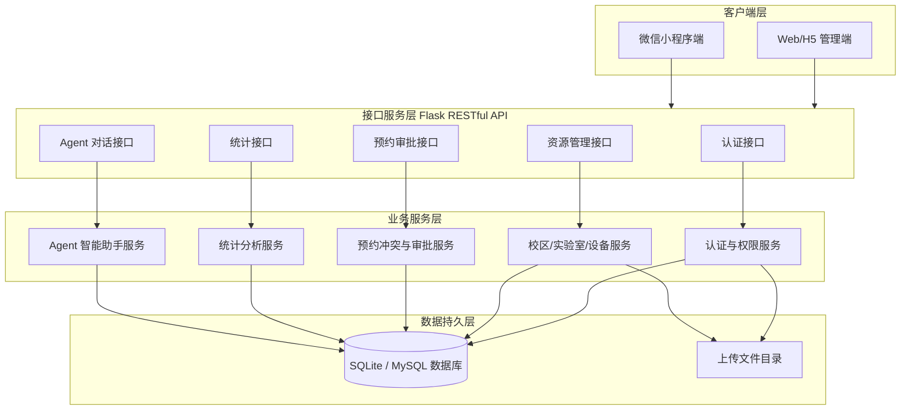

图3-1 系统总体架构图

### 3.2 分层架构设计

#### 3.2.1 后端目录与层次划分

为了提高系统可维护性和扩展性，后端采用较清晰的分层结构，主要包括 API 层、Service 层、Model 层、Utils 层和配置层。项目后端目录中，`app/api` 用于组织接口路由，`app/services` 用于封装业务逻辑，`app/models` 用于定义数据库模型，`app/utils` 用于存放统一响应、异常处理、字段校验和权限装饰器等通用工具。

#### 3.2.2 API 层与 Service 层职责

API 层负责接收前端请求、解析参数、执行基础权限装饰器校验，并调用对应 Service 完成业务处理。系统按业务模块划分接口文件，包括认证、校区、实验室、设备、预约、审批、统计、用户和 Agent 等接口。通过模块化的路由组织方式，可以使接口职责更加清晰，也便于后续新增功能。

Service 层是系统业务规则的核心承载层。预约模块中的时间合法性校验、开放时间校验、容量校验、预约冲突检测和审批状态处理均应集中在 Service 层完成。统计模块中的总览统计、校区统计和实验室利用率统计也由 Service 层进行聚合处理。Agent 模块通过 Service 层识别用户意图并调用预约、实验室和统计等业务工具，保证智能助手不绕过系统原有业务规则。

#### 3.2.3 Model 层、Utils 层与配置层职责

Model 层负责定义系统数据实体和对象关系映射。系统使用 Flask-SQLAlchemy 对 SQLAlchemy 进行集成，主要实体包括 Campus、User、Laboratory、Equipment、Reservation、Approval 和 OperationLog。各实体通过外键关系建立关联，例如实验室归属于校区，设备归属于实验室，预约关联用户、校区和实验室，审批记录关联预约和审批人。

Utils 层负责提供跨模块复用能力，包括统一响应结构、业务异常类型、字段校验函数和角色权限装饰器等。通过统一工具封装，系统能够保持接口响应格式一致，并减少重复代码。

配置层负责读取环境变量、初始化数据库连接、配置 JWT 密钥、上传目录和 Agent 相关参数。系统支持通过环境变量选择 SQLite、MySQL 或指定 `DATABASE_URL`，从而适配开发、测试和部署等不同运行环境。为了便于说明后端各层在项目目录中的落点及其职责，表3-1 对系统分层结构进行了汇总。

表3-1 系统分层结构说明表

| 层次 | 对应目录/模块 | 主要职责 |
| --- | --- | --- |
| API 层 | `app/api` | 接收请求、参数解析、路由分发、调用服务层 |
| Service 层 | `app/services` | 处理预约冲突、审批流转、统计聚合、Agent 业务逻辑 |
| Model 层 | `app/models` | 定义数据模型、对象关系映射、实体序列化 |
| Utils 层 | `app/utils` | 统一响应、异常处理、字段校验、权限装饰器 |
| 配置层 | `app/config.py` | 数据库连接、JWT 密钥、上传目录、Agent 参数配置 |

### 3.3 核心业务流程设计

系统核心业务流程主要包括登录认证流程、预约创建流程、审批流程、预约取消流程和 Agent 对话流程。其中，预约创建与审批流程是实验室管理系统的核心，直接关系到资源使用的规范性和冲突控制效果。预约调度与排队机制相关研究表明，合理的预约管理流程有助于提高共享实验资源利用率[7]，实验室预约系统实践也说明，在线预约和状态管理能够改善传统人工预约效率低的问题[5][6][9]。

#### 3.3.1 登录认证流程

登录认证是系统权限控制的入口。用户在客户端输入账号和密码后，前端向后端认证接口发送登录请求；后端验证账号状态和密码正确性；验证通过后生成 JWT token，并将用户基本信息、角色和校区信息返回前端；前端保存 token，并在后续请求中通过 Authorization 请求头携带 token；后端接口通过 JWT 校验用户身份，再根据用户角色判断是否允许访问对应功能。图3-2 进一步展示了客户端、认证接口、认证服务和数据库之间的交互顺序。

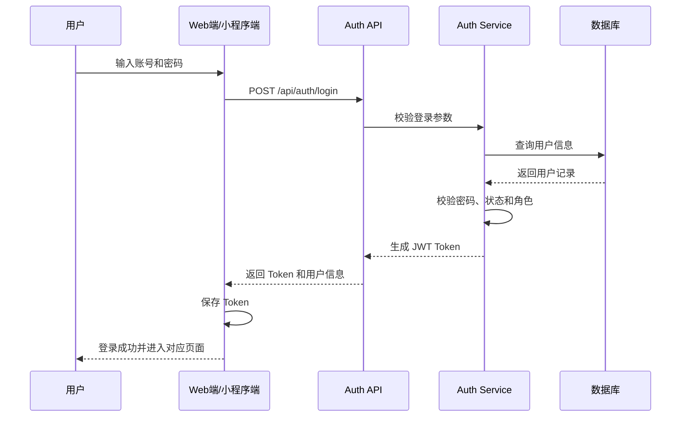

图3-2 登录认证流程图

#### 3.3.2 预约创建流程

预约创建是系统中业务校验最集中的流程。用户在实验室详情或预约页面选择校区、实验室、日期、开始时间、结束时间、预约用途和参与人数后提交申请；后端首先校验必填字段，然后检查实验室是否存在且状态可用；接着校验预约校区是否与实验室所属校区一致，预约开始时间是否早于结束时间，预约时段是否位于实验室开放时间内，参与人数是否超过实验室容量；最后系统查询该实验室同一天已有的待审批或已通过预约，判断时间段是否发生重叠。如果校验均通过，则根据用户角色创建预约记录，学生和教师预约默认为待审批状态，管理员预约可按规则自动通过。图3-3 对这一流程进行了抽象展示。

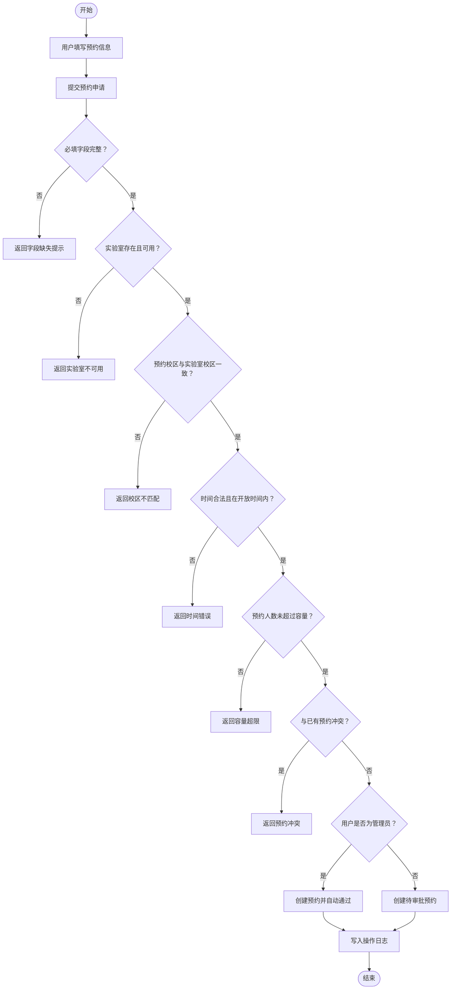

图3-3 预约创建流程图

#### 3.3.3 审批与取消流程

审批流程如下：实验室管理员或系统管理员进入审批页面查看待审批预约；系统根据管理员角色限制可见数据范围，实验室管理员只能查看本校区待审批预约，系统管理员可查看全部校区预约；管理员选择通过或拒绝，并填写审批意见；后端更新预约状态，创建审批记录，并写入操作日志。审批结果会影响用户在“我的预约”页面中看到的预约状态。

预约取消流程如下：用户进入个人预约列表或预约详情页，选择可取消的预约记录；后端判断当前用户是否为预约发起人或具备管理权限，并判断预约状态是否允许取消；校验通过后更新预约状态为已取消，并记录操作日志。该流程能够保证普通用户不能取消他人预约，也避免已完成或已拒绝预约被重复操作。

#### 3.3.4 Agent 对话流程

Agent 对话流程如下：用户在 Agent 页面输入自然语言问题；前端将问题和用户登录状态发送至后端 Agent 接口；后端根据用户输入进行意图识别，如“我的预约”“可预约实验室”“实验室排期”“统计概况”等；系统根据识别结果调用对应业务工具查询数据库，并结合当前用户角色进行权限校验；最后返回文本回复、结构化数据和可选页面跳转动作。该流程将自然语言交互与系统业务工具结合起来，是本文系统区别于传统实验室管理系统的重要设计。为便于对比不同核心流程的触发角色和主要处理步骤，表3-2 对上述流程进行了汇总。

表3-2 核心业务流程说明表

| 流程名称 | 触发角色 | 主要步骤 |
| --- | --- | --- |
| 登录认证流程 | 全部用户 | 输入账号密码、验证用户、签发 JWT、返回用户信息 |
| 预约创建流程 | 学生、教师、管理员 | 填写预约信息、校验实验室、检测冲突、生成预约记录 |
| 审批流程 | 实验室管理员、系统管理员 | 查看待审批预约、通过/拒绝、记录审批意见 |
| 预约取消流程 | 预约发起人、管理员 | 校验权限、判断状态、更新预约为取消 |
| Agent 对话流程 | 全部用户 | 输入自然语言、识别意图、调用工具、返回回复和动作 |

### 3.4 权限与安全机制设计

#### 3.4.1 身份认证与角色控制

系统权限与安全机制围绕身份认证、角色权限控制、校区级数据隔离、接口访问控制和文件上传控制展开。系统采用 JWT 实现用户登录后的身份认证，用户登录成功后由后端签发 token，客户端在后续请求中携带 token 访问受保护接口。JWT 适合前后端分离系统中的无状态认证场景[12]，能够减少服务端会话维护成本。

在角色权限控制方面，系统结合 RBAC 思想，将用户权限与角色绑定[13]。学生和教师属于普通用户角色，主要访问实验室查询、预约申请、我的预约和 Agent 等功能；实验室管理员属于校区级管理角色，主要负责本校区实验室、设备、预约审批和统计查看；系统管理员拥有全局管理权限，可以维护所有校区、用户、实验室、设备和系统级统计数据。

#### 3.4.2 数据隔离与文件上传控制

在校区级数据隔离方面，系统针对实验室管理员设置数据范围限制。实验室管理员只能管理其所属校区下的实验室、设备和预约记录，不能修改其他校区数据。该设计既支持跨校区资源统一查询，又保证管理权限不会跨校区越界。

在预约数据安全方面，学生和教师只能查看、取消和查询自己的预约记录，不能通过接口访问其他用户预约详情。对于预约审批接口，系统只允许实验室管理员和系统管理员访问，并根据角色进一步限制审批范围。Agent 智能助手也需要复用该权限逻辑，防止普通用户通过自然语言方式查询管理员统计或他人预约信息。

在文件上传安全方面，系统需要对用户头像、校区封面和实验室照片等上传文件进行类型和大小限制，并将上传目录与业务数据分离管理。生产环境下还应结合 Nginx、静态资源托管和访问路径控制，避免上传文件带来安全风险。

### 3.5 数据库设计

#### 3.5.1 数据库实体关系设计

系统数据库设计围绕多校区实验室预约管理业务展开，主要包括校区表、用户表、实验室表、设备表、预约表、审批表和操作日志表。各数据表之间通过外键建立关联关系，以支持资源查询、预约审批、统计分析和操作追踪等功能。

在数据库层面，系统实体围绕校区、用户、实验室、设备、预约、审批和操作日志展开。图3-4 展示了这些实体之间的主要关联关系，其中校区与实验室、用户和预约相关联，实验室与设备和预约相关联，预约与审批记录相关联，用户与预约、审批和操作日志相关联。

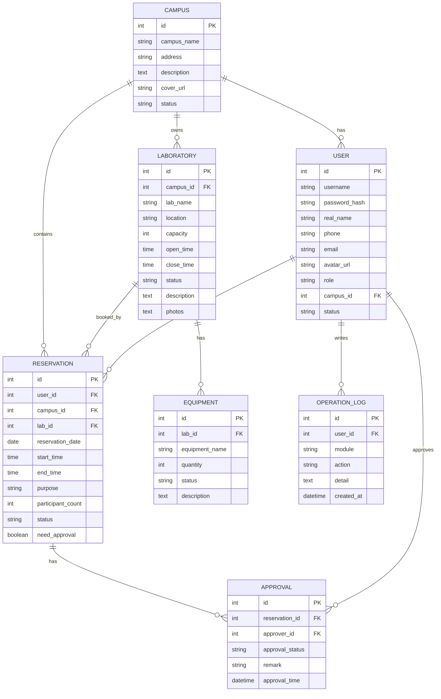

图3-4 数据库 E-R 图

#### 3.5.2 基础数据表设计

校区表用于保存学校不同校区的基础信息，包括校区名称、地址、简介、封面图和状态等字段。校区是实验室资源组织的基础，实验室、用户和预约均可与校区建立关联。

用户表用于保存系统用户信息，包括用户名、密码哈希、真实姓名、联系方式、邮箱、头像、角色、所属校区和状态等字段。其中，角色字段用于区分学生、教师、实验室管理员和系统管理员；所属校区字段用于限制实验室管理员的数据管理范围。

实验室表用于保存实验室资源信息，包括所属校区、实验室名称、位置、容量、开放时间、关闭时间、状态、简介和图片等字段。实验室表与校区表之间为多对一关系，即一个校区可以拥有多个实验室，一个实验室只归属于一个校区。

设备表用于保存实验室设备信息，包括所属实验室、设备名称、数量、状态和说明等字段。设备表与实验室表之间为多对一关系，用于描述某个实验室下的设备配置情况。

预约表用于保存实验室预约记录，包括预约用户、校区、实验室、预约日期、开始时间、结束时间、预约用途、参与人数、预约状态和是否需要审批等字段。预约表是系统业务流程的核心表，与用户表、校区表和实验室表均存在关联关系。系统通过查询预约表判断指定实验室在某个时间段是否已被预约，从而实现预约冲突检测。

审批表用于保存预约审批记录，包括预约编号、审批人、审批状态、审批意见和审批时间等字段。审批表与预约表和用户表关联，用于记录管理员对预约申请的处理过程。

操作日志表用于保存系统关键操作记录，包括操作用户、模块名称、操作类型、操作详情和操作时间等字段。该表用于增强系统可追踪性，便于后续进行管理审计和问题定位。

#### 3.5.3 主要数据表与预约字段设计

在实体关系设计的基础上，表3-3 对系统主要数据表及其用途进行了说明，便于从数据存储角度理解各业务模块之间的联系。

表3-3 主要数据表说明表

| 数据表 | 对应模型 | 主要用途 |
| --- | --- | --- |
| `campuses` | `Campus` | 保存校区基础信息 |
| `users` | `User` | 保存用户、角色和所属校区 |
| `laboratories` | `Laboratory` | 保存实验室基础信息和开放时间 |
| `equipment` | `Equipment` | 保存实验室设备信息 |
| `reservations` | `Reservation` | 保存预约申请、时间和状态 |
| `approvals` | `Approval` | 保存预约审批记录 |
| `operation_logs` | `OperationLog` | 保存关键操作日志 |

由于预约表是系统实现预约冲突检测、审批流转和个人预约查询的核心数据表，其字段设计会直接影响后续预约校验和统计分析的实现。因此，表3-4 进一步列出了预约表的主要字段。

表3-4 预约表字段设计表

| 字段名 | 数据类型 | 含义 |
| --- | --- | --- |
| `id` | Integer | 预约编号 |
| `user_id` | Integer | 预约用户编号 |
| `campus_id` | Integer | 校区编号 |
| `lab_id` | Integer | 实验室编号 |
| `reservation_date` | Date | 预约日期 |
| `start_time` | Time | 开始时间 |
| `end_time` | Time | 结束时间 |
| `purpose` | String | 预约用途 |
| `participant_count` | Integer | 参与人数 |
| `status` | String | 预约状态 |
| `need_approval` | Boolean | 是否需要审批 |

## 第4章 关键模块设计与实现

在总体架构和数据库结构确定之后，系统实现需要围绕核心业务模块展开。本章结合项目后端 API、Service、Model 与前端多端访问方式，重点说明用户认证与权限管理、校区/实验室/设备管理、预约与审批、统计分析、Agent 接入以及前后端接口交互等关键模块的设计与实现。通过将公共认证、业务校验、数据访问和响应格式统一封装，系统能够在 Web/H5 端和微信小程序端之间复用同一套后端业务能力，减少多端重复实现带来的维护成本。

### 4.1 用户认证与权限管理模块

#### 4.1.1 登录认证实现

用户认证与权限管理模块是系统安全运行的基础。系统后端通过 `/api/auth/login` 接口接收用户名、密码和角色等登录信息，在服务层完成用户查询、密码校验、账号状态判断和角色匹配。登录成功后，后端生成 JWT token，并将 token、用户基本信息、角色和所属校区返回给前端。前端在后续访问受保护接口时，将 token 放入请求头中，由后端统一完成身份校验。JWT 的无状态特性适合前后端分离系统，能够降低服务端会话维护压力[12]。

#### 4.1.2 角色权限与校区范围控制

在权限控制方面，系统采用基于角色的访问控制思想[13]，将用户分为学生、教师、实验室管理员和系统管理员。学生和教师主要使用实验室查询、预约申请、个人预约和 Agent 智能助手等功能；实验室管理员能够管理本校区实验室、设备、审批和统计数据；系统管理员具备全局管理权限。项目中通过权限装饰器对接口访问角色进行限制，并在涉及校区资源的数据操作中加入校区范围校验，保证实验室管理员只能处理本校区数据。

为了体现认证、角色判断和校区级数据隔离之间的关系，图4-1 对系统接口访问时的权限校验过程进行了归纳。该流程说明，系统并非只判断用户是否登录，还会根据接口要求进一步判断角色和数据范围，从而减少越权访问风险。

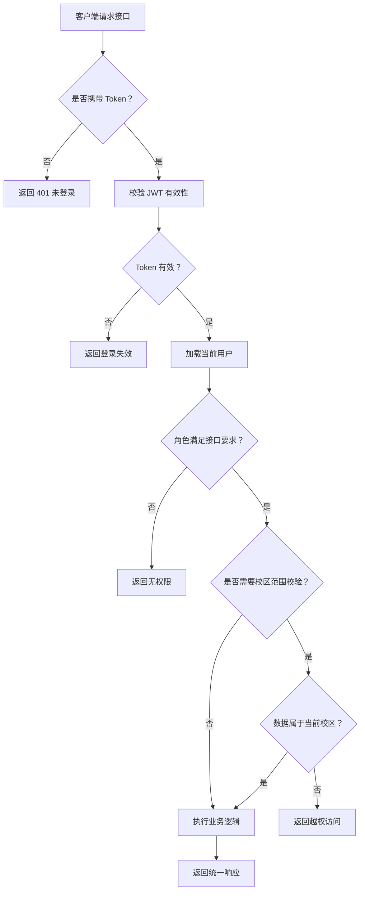

图4-1 用户认证与权限校验流程图

### 4.2 校区、实验室与设备管理模块

#### 4.2.1 校区与实验室管理

校区、实验室和设备是系统资源管理的基础数据。校区管理模块用于维护校区名称、地址、简介、封面和启用状态等信息，为多校区资源组织提供基础。系统管理员可以对校区进行新增、编辑、删除和封面上传，普通用户主要用于查看校区列表和校区详情。

实验室管理模块以校区为上级资源，记录实验室名称、位置、容量、开放时间、关闭时间、状态、简介和图片等信息。系统管理员可以管理所有校区的实验室，实验室管理员只能管理所属校区实验室。实验室开放时间和容量信息不仅用于展示，也会在预约提交时参与业务校验，因此该模块与预约管理模块存在直接关联。

#### 4.2.2 设备管理与资源关系

设备管理模块以实验室为归属单位，记录设备名称、数量、状态和说明等信息。设备状态能够帮助用户判断实验室资源是否满足实验或教学活动要求，也为后续接入物联网设备状态监测、智慧实验室运行分析等扩展能力提供数据基础[18][19]。

从业务关系看，校区、实验室和设备并不是孤立维护的三类数据，而是共同构成实验室资源管理链路。图4-2 展示了资源管理模块之间的关系：校区是实验室的组织维度，实验室承载设备和预约，图片上传则用于提升资源展示效果。

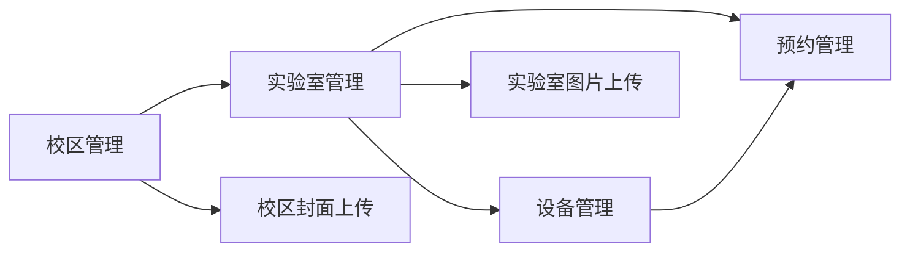

图4-2 资源管理模块关系图

### 4.3 预约与审批模块

#### 4.3.1 预约提交与前置校验

预约与审批模块是系统的核心业务模块。用户在前端选择校区、实验室、日期、开始时间、结束时间、预约用途和参与人数后提交预约申请。后端接收到请求后，并不直接写入预约记录，而是在服务层依次执行字段完整性校验、实验室状态校验、校区匹配校验、时间顺序校验、开放时间校验、容量校验和冲突检测。只有全部校验通过后，系统才会创建预约记录。

#### 4.3.2 冲突检测与状态流转

在冲突检测方面，系统主要判断同一实验室、同一日期下是否存在待审批或已通过的预约记录，并通过时间区间重叠条件判断是否冲突。若已有预约的开始时间早于本次结束时间，且已有预约的结束时间晚于本次开始时间，则说明两个时间段存在交叉，系统应拒绝本次预约。该设计能够避免同一实验室在同一时间段被重复占用，是提升资源利用有序性的关键[6][7][8]。

预约创建成功后，系统根据用户角色确定初始状态。学生和教师提交的预约默认进入 `pending` 状态，等待管理员审批；实验室管理员或系统管理员根据业务规则创建的预约可以直接进入 `approved` 状态。审批过程中，管理员可以对待审批预约执行通过或拒绝操作，系统同步更新预约状态，写入审批记录，并记录操作日志，保证审批过程可追踪。在线预约和审批流转机制能够改善传统线下登记效率低、记录分散和追踪困难的问题[5][9]。

见表4-2，本文将预约提交阶段的主要校验项、校验目的和不通过处理方式进行了对应说明。通过表格可以看出，预约模块的实现重点不是简单的数据新增，而是围绕实验室资源约束建立一组前置规则，确保预约记录具有业务有效性。

表4-2 预约校验规则实现表

| 校验项 | 校验目的 | 不通过处理 |
| --- | --- | --- |
| 必填字段 | 保证预约信息完整 | 返回字段缺失 |
| 实验室状态 | 保证实验室可预约 | 返回实验室不可用 |
| 校区匹配 | 避免跨校区错误预约 | 返回校区不匹配 |
| 时间顺序 | 保证开始时间早于结束时间 | 返回时间错误 |
| 开放时间 | 保证预约在开放时段内 | 返回不在开放时间 |
| 容量限制 | 避免超过实验室容量 | 返回容量超限 |
| 时间冲突 | 避免重复预约 | 返回预约冲突 |

预约状态的变化贯穿用户提交、管理员审批和用户取消等操作。为便于说明各状态之间的转换关系，图4-3 将预约审批状态抽象为状态流转图。该图体现了普通用户预约与管理员预约在初始状态上的差异，也体现了取消、通过和拒绝等操作对预约生命周期的影响。

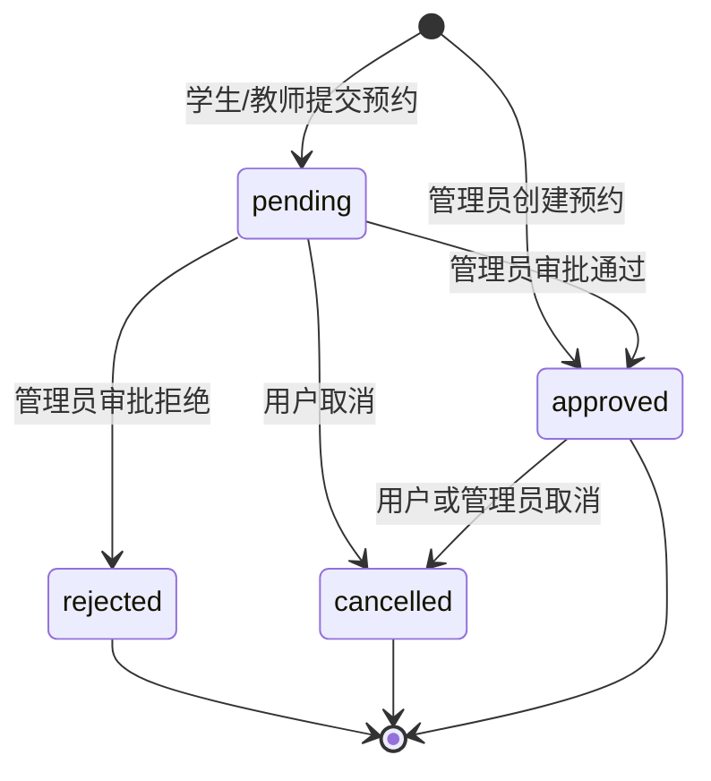

图4-3 预约审批状态流转图

### 4.4 统计分析模块

统计分析模块主要服务于管理员的数据查看和管理决策。系统后端提供总览统计、校区维度统计和实验室利用率统计等接口，统计内容包括校区数量、实验室数量、预约总数、待审批数量、已通过数量和实验室使用情况等。系统管理员可以查看全局统计数据，实验室管理员只能查看本校区范围内的统计数据。

从实现方式看，统计分析模块主要通过服务层对校区、实验室和预约表进行聚合查询。总览统计用于展示系统整体运行情况；校区统计用于对比不同校区实验室数量和预约数量；实验室利用率统计用于分析不同实验室被预约的频次和状态分布。相关研究表明，将实验室运行数据进行集中统计和可视化呈现，有助于提升实验室管理效率和资源配置科学性[4][10][11][17]。

### 4.5 智能助手接入模块

传统实验室管理系统通常依赖菜单、列表和筛选项完成资源查询。对于普通用户而言，如果需要快速了解个人预约、某个实验室排期或指定日期可预约实验室，仍然需要在多个页面之间切换。为降低系统使用门槛，本文在后端预留 Agent 服务入口，通过 `/api/agent/chat` 接口为 Web/H5 端和微信小程序端提供统一的智能问答能力。

在第四章中，Agent 模块主要作为关键功能入口进行说明。它与认证、预约、实验室和统计模块不是割裂关系，而是通过后端服务层复用已有数据模型和业务规则。用户提出自然语言问题后，系统识别意图并调用对应业务工具查询真实数据，再返回文本回复、结构化结果或页面跳转动作。Agent 的详细设计目标、总体架构、意图识别、工具调用和创新点将在第五章单独展开。

### 4.6 前后端接口交互设计

#### 4.6.1 接口调用链路

系统采用前后端分离方式实现，Web/H5 端和微信小程序端均通过 HTTP 请求访问 Flask 后端提供的 RESTful API。前端请求模块负责配置基础地址、携带 token、处理接口响应和统一错误提示；后端 API 层负责接收请求、解析参数、调用权限装饰器，并将业务处理交给 Service 层。Service 层完成数据库查询、业务校验和状态更新后，由 API 层返回统一 JSON 响应。

#### 4.6.2 核心接口与响应格式

为了便于不同前端复用接口，系统将主要接口按业务模块划分。表4-1 汇总了认证、资源管理、预约审批、统计分析和 Agent 对话等核心接口，Web/H5 管理端和微信小程序端可以根据各自页面需求选择调用相同后端能力，避免出现多端业务规则不一致的问题。

表4-1 核心接口说明表

| 模块 | 接口示例 | 说明 |
| --- | --- | --- |
| 认证 | `/api/auth/login` | 用户登录并返回 Token |
| 校区 | `/api/campuses` | 校区列表、详情和维护 |
| 实验室 | `/api/labs` | 实验室列表、详情、排期和维护 |
| 设备 | `/api/equipment` | 设备列表和维护 |
| 预约 | `/api/reservations` | 创建预约、取消预约、查询预约 |
| 审批 | `/api/approvals` | 待审批列表、通过或拒绝预约 |
| 统计 | `/api/statistics` | 总览统计、校区统计和利用率统计 |
| Agent | `/api/agent/chat` | Agent 智能助手对话 |

在接口实际调用过程中，前端页面、请求封装、后端 API、业务服务和数据库之间会形成固定的交互链路。图4-4 对这一链路进行了展示：前端页面调用请求封装方法后，请求模块自动注入 token 和基础路径，后端完成参数校验、权限校验和业务处理，并以统一结构返回结果。该流程使前端页面能够专注于交互展示，后端则集中承担业务规则和数据安全控制。

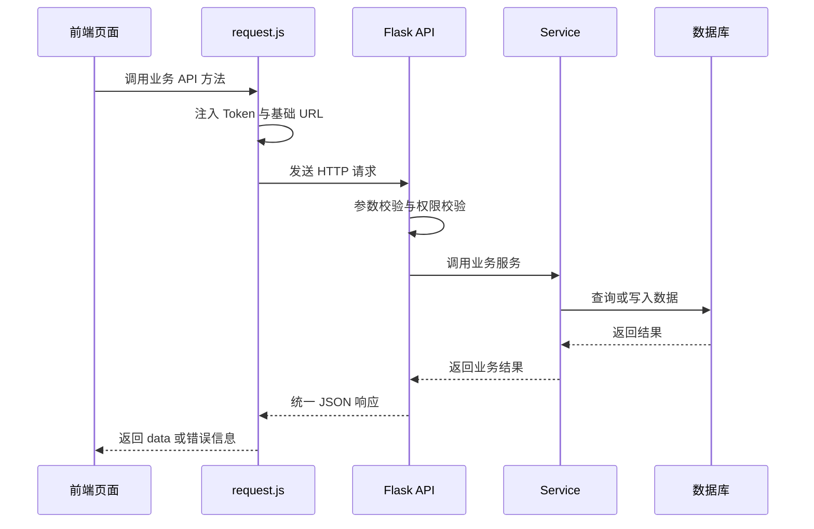

图4-4 前后端接口交互流程图

系统统一响应格式由 `code`、`message` 和 `data` 三部分组成，既方便前端判断业务是否成功，也便于显示错误信息和渲染数据内容。表4-3 对统一响应字段进行了说明。

表4-3 统一响应格式说明表

| 字段 | 类型 | 说明 |
| --- | --- | --- |
| `code` | Integer | 业务状态码，0 表示成功 |
| `message` | String | 响应提示信息 |
| `data` | Object/Array/null | 响应数据主体 |

## 第5章 Agent 智能助手模块设计与实现

Agent 智能助手是本文系统区别于传统实验室预约管理系统的重要创新点。传统预约系统主要通过页面菜单和表单完成操作，用户需要先理解系统功能结构，再进入对应页面查询或提交信息。本文设计的 Agent 模块则将自然语言交互、业务工具调用、权限控制和页面动作结合起来，使用户能够以更接近真实需求表达的方式完成资源查询和预约辅助。

### 5.1 Agent 模块设计目标

本文设计的 Agent 并不是开放式闲聊机器人，而是面向实验室预约场景的智能辅助模块。其设计目标主要包括以下几个方面。

#### 5.1.1 查询成本降低与业务复用

第一，降低用户查询成本。学生和教师可以直接询问“我的预约有哪些”“明天有哪些实验室可以预约”“某实验室今天排期如何”等问题，系统自动识别需求并返回结果，减少用户在多个页面之间切换的操作。

第二，复用系统已有业务能力。Agent 不单独维护数据，也不直接绕过后端规则访问数据库，而是调用预约、实验室、统计等业务工具。这样既能保证回答结果来自系统真实数据，也能保证权限边界与普通接口一致。

#### 5.1.2 多端接入与扩展能力

第三，支持多端统一接入。Web/H5 端和微信小程序端均可通过 `/api/agent/chat` 接口访问 Agent 服务，后端统一完成意图识别、工具调用和结果封装，前端只需根据返回内容进行展示或页面跳转。

第四，兼顾稳定性与扩展性。系统默认提供规则模式，使毕业设计演示和本地运行不依赖外部大模型服务；同时通过配置项预留 LLM 接入能力，为后续实现更复杂的多轮对话、语义理解和推荐能力提供扩展空间。ReAct 研究提出的“推理与行动结合”思想为工具调用型智能体提供了重要参考[20]，大语言模型智能体相关综述也说明，工具使用和任务规划是智能体系统的重要组成部分[21]。

### 5.2 Agent 总体架构设计

#### 5.2.1 处理链路设计

Agent 模块采用“接口接入、意图识别、工具调用、权限校验、回复生成”的处理链路。用户在前端 Agent 页面输入自然语言问题后，前端将问题发送至后端 Agent API。后端 Agent Service 根据输入内容识别用户意图，并选择对应工具，例如个人预约工具、可预约实验室工具、实验室排期工具、统计概况工具或页面动作工具。工具执行时复用系统已有数据模型和业务规则，最后由 Agent Service 将结果组织为文本回复、结构化数据和可选页面跳转动作。

#### 5.2.2 与业务模块的协作关系

为了说明 Agent 与系统其他模块之间的协作关系，图5-1 展示了 Agent 总体架构。由图可见，Agent 位于用户自然语言输入和系统业务服务之间，承担意图转换和工具编排作用，但底层数据仍来自统一业务数据库。

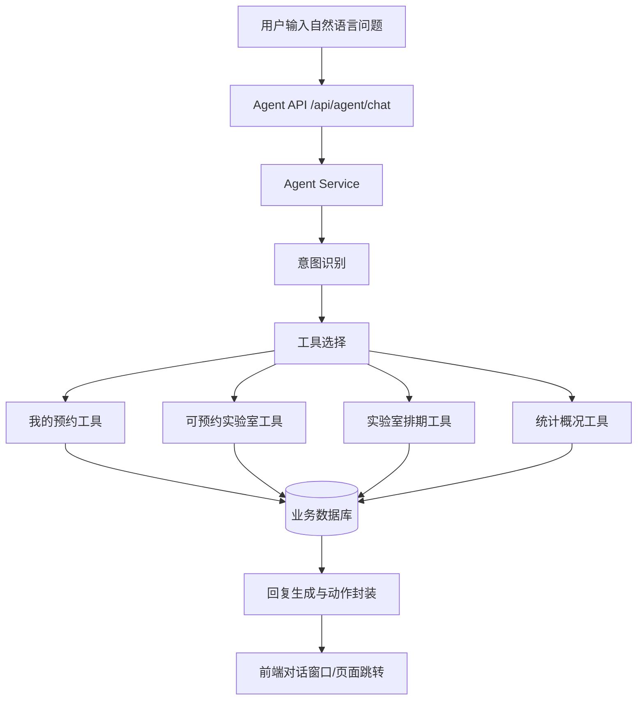

图5-1 Agent 总体架构图

### 5.3 意图识别与规则模式设计

#### 5.3.1 规则模式识别策略

规则模式是 Agent 模块的基础运行方式。系统根据用户输入中的关键词、日期表达式、实验室名称、校区名称、人数和时间等信息进行轻量级意图识别与参数抽取。常见意图包括个人预约查询、可预约实验室查询、实验室排期查询、统计概况查询和帮助引导等。当用户输入无法识别时，系统不直接返回错误，而是给出可询问内容示例，引导用户继续表达需求。

规则模式的优势在于运行稳定、实现可控、无需外部服务依赖，适合毕业设计演示和基础业务场景。例如，当用户输入“明天有哪些实验室可以预约”时，系统识别为可预约实验室查询，抽取日期为明天，再结合实验室状态、开放时间和已有预约记录筛选可用资源；当用户输入“我的预约”时，系统识别为个人预约查询，并根据当前登录用户 ID 查询预约列表。

#### 5.3.2 意图类型与工具映射

见表5-1，本文对 Agent 的主要意图类型、示例问句和调用工具进行了归纳。该表说明 Agent 的能力边界与实验室预约业务紧密相关，避免将系统扩展为不受控制的泛化聊天工具。

表5-1 Agent 意图类型说明表

| 意图类型 | 示例问句 | 调用工具 |
| --- | --- | --- |
| 个人预约查询 | 我的预约有哪些？ | 我的预约工具 |
| 可预约实验室查询 | 明天有哪些实验室可以预约？ | 可预约实验室工具 |
| 实验室排期查询 | 查看某实验室今天的排期 | 排期查询工具 |
| 统计概况查询 | 查看系统统计概况 | 统计工具 |
| 帮助引导 | 我可以问什么？ | 引导回复 |

在具体执行过程中，Agent 需要先完成文本预处理和意图识别，再进入工具调用与权限校验环节。图5-2 展示了规则模式下的意图识别与工具调用流程。该流程体现了 Agent “先理解需求、再调用工具、最后生成回复”的基本工作方式。

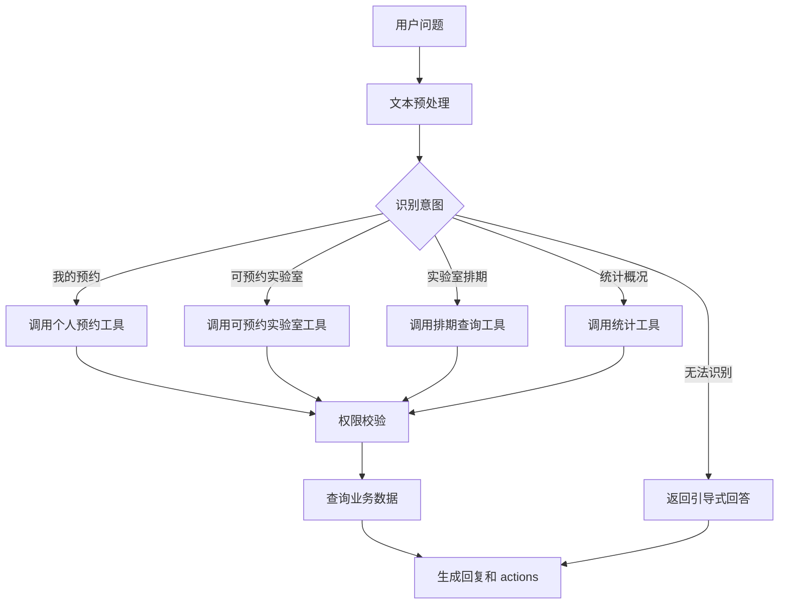

图5-2 Agent 意图识别与工具调用流程图

### 5.4 工具调用与业务数据访问

#### 5.4.1 工具封装方式

工具调用是 Agent 模块连接自然语言输入和业务系统的关键。本文将常见业务能力封装为工具，使 Agent 在识别用户意图后能够调用对应工具完成数据查询或页面动作生成。个人预约工具根据当前登录用户 ID 查询预约记录，保证学生和教师只能查看自己的预约；可预约实验室工具综合实验室状态、开放时间、容量和已有预约记录筛选可用资源；排期查询工具按实验室和日期返回预约安排，帮助用户避开冲突时段；统计工具主要面向管理员角色，普通用户不能通过 Agent 获取管理统计数据；页面动作工具用于返回前端可识别的跳转路径。

#### 5.4.2 权限边界控制

Agent 工具调用必须遵循系统原有权限边界。对于普通用户，Agent 只能返回个人预约、公开实验室信息和可预约资源；对于实验室管理员，Agent 返回的数据应限制在其所属校区范围内；对于系统管理员，Agent 可以返回全局统计和跨校区资源信息。该设计避免了自然语言交互成为越权访问入口。

见表5-2，本文对 Agent 工具名称、数据来源、权限要求和输出内容进行了说明。从表中可以看出，Agent 工具并不脱离系统业务模块，而是对已有业务能力进行面向自然语言交互的再封装。

表5-2 Agent 工具调用能力表

| 工具名称 | 数据来源 | 权限要求 | 输出内容 |
| --- | --- | --- | --- |
| 我的预约工具 | reservations | 登录用户本人 | 个人预约列表 |
| 可预约实验室工具 | laboratories, reservations | 登录用户 | 可预约实验室列表 |
| 排期查询工具 | reservations | 登录用户 | 指定实验室排期 |
| 统计工具 | statistics | 管理员角色 | 统计概况 |
| 页面动作工具 | navigation config | 登录用户 | 跳转路径和动作 |

### 5.5 LLM 可扩展模式设计

#### 5.5.1 扩展配置设计

在基础规则模式之外，系统预留了 LLM 扩展能力。后端配置中包含 `AGENT_PROVIDER`、`AGENT_MODEL`、`LLM_API_KEY` 和 `LLM_BASE_URL` 等参数，便于在具备外部模型服务条件时，将复杂自然语言理解、参数补全和回复润色交给大语言模型处理。

#### 5.5.2 规则驱动与模型增强结合

需要强调的是，LLM 扩展模式并不意味着让大模型直接决定数据库结果。本文采用“规则驱动为主、LLM 扩展为辅”的设计思路：LLM 可以辅助判断用户意图、补全缺失参数或生成更自然的回复，但涉及预约状态、实验室排期、冲突检测和权限判断的内容仍由后端工具完成。这样既能利用大语言模型在语言理解方面的优势，又能保证系统回答不脱离真实业务数据。

这种设计与工具调用型智能体思想一致，即智能体通过推理确定下一步动作，再调用外部工具获取可靠结果[20][21]。在本文系统中，预约工具、排期工具和统计工具就是 Agent 与真实业务系统之间的动作接口。

### 5.6 Agent 前端交互与应用效果

#### 5.6.1 对话窗口与页面动作

Agent 前端交互主要由对话窗口、消息展示、结构化结果和页面动作组成。用户输入问题后，前端展示用户消息并调用 `/api/agent/chat` 接口；后端返回回复文本、结构化数据和可选 `actions`；前端根据返回内容展示结果，或根据页面动作跳转到实验室列表、预约页面、我的预约页面等目标页面。通过这种方式，Agent 不仅能够回答问题，还可以帮助用户定位后续操作入口。

如图5-3所示，Agent 页面动作返回流程包括用户输入、接口请求、工具调用、结构化响应和前端跳转等环节。该流程说明，Agent 的价值不只在于生成文本，还在于把自然语言需求转化为可执行的页面动作，从而减少用户查找功能入口的时间。

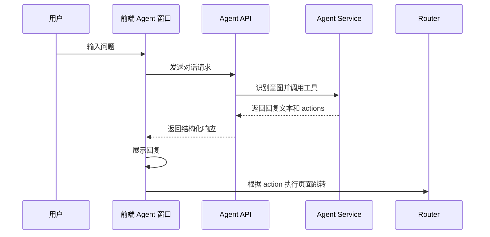

图5-3 Agent 页面动作返回流程图

#### 5.6.2 典型问句与效果验证

为了验证 Agent 是否能够覆盖常见使用场景，本文选取个人预约查询、可预约实验室查询、实验室排期查询、统计概况查询和帮助引导等典型问句进行测试设计。表5-3 展示了部分典型问句及预期结果。

表5-3 Agent 测试问句与预期结果表

| 测试问句 | 预期意图 | 预期结果 |
| --- | --- | --- |
| 我的预约有哪些？ | 个人预约查询 | 返回当前用户预约列表 |
| 明天有哪些实验室可以预约？ | 可预约实验室查询 | 返回符合条件的实验室 |
| 查看实验室A今天排期 | 实验室排期查询 | 返回该实验室排期 |
| 查看统计概况 | 统计概况查询 | 管理员返回统计，普通用户提示无权限 |
| 你好 | 帮助引导 | 返回可询问内容示例 |

### 5.7 本章小结

本章围绕 Agent 智能助手模块展开设计与实现说明。该模块不是简单增加一个聊天窗口，而是将自然语言交互、业务工具调用、权限控制和页面动作结合到实验室预约业务中。Agent 通过统一接口服务 Web/H5 端和微信小程序端，在不破坏原有系统架构的前提下，为用户提供更低门槛的资源查询和预约辅助能力，是本文系统的重要创新点。

## 第6章 系统测试与结果分析

系统测试的目标是验证各功能模块是否满足需求分析中提出的功能要求，并检查权限控制、预约边界条件和 Agent 智能助手等关键环节是否能够稳定运行。本章从测试环境、功能测试、权限与边界测试、性能与稳定性测试、Agent 模块测试和测试结果分析几个方面展开说明。

### 6.1 测试环境与测试方法

#### 6.1.1 测试环境

本系统主要在本地开发环境下进行功能验证。后端使用 Python 与 Flask 框架运行，数据库可根据配置选择 SQLite 或 MySQL；Web/H5 端通过浏览器或 HBuilderX 进行调试；微信小程序端通过微信开发者工具进行页面和接口联调。测试过程中分别准备学生、教师、实验室管理员和系统管理员账号，以验证不同角色下的功能入口、数据范围和接口权限是否符合预期。

见表6-1，本文对测试环境进行了归纳。该表用于说明测试所依赖的软件环境和工具，保证测试结果具有基本可复现性。

表6-1 测试环境表

| 环境项 | 配置 |
| --- | --- |
| 操作系统 | Windows |
| 后端环境 | Python + Flask |
| 数据库 | SQLite / MySQL |
| Web 端 | 浏览器 / HBuilderX |
| 小程序端 | 微信开发者工具 |
| 接口测试 | 浏览器、前端页面或接口工具 |

#### 6.1.2 测试方法

系统测试按照“准备环境、准备账号和数据、执行功能测试、执行权限与边界测试、执行 Agent 测试、记录问题、修复并回归”的顺序进行。图6-1 展示了整体测试流程，有助于体现测试工作不是零散点击页面，而是围绕功能闭环和风险点进行验证。

图6-1 系统测试流程图

### 6.2 功能测试

#### 6.2.1 测试范围

功能测试主要验证系统各业务模块是否能够按照需求完成操作。测试内容覆盖登录认证、校区管理、实验室管理、设备管理、预约提交、预约审批、统计分析等核心功能。对于管理类功能，重点检查新增、编辑、删除和查询是否正常；对于预约类功能，重点检查预约创建后状态是否正确、审批后状态是否同步更新；对于统计类功能，重点检查返回数据是否与数据库记录一致。

#### 6.2.2 测试用例与结果

见表6-2，本文列出了主要功能测试用例及预期结果。测试结果表明，在准备好基础数据和合法账号的情况下，各模块能够完成预期功能。

表6-2 功能测试用例表

| 测试编号 | 测试模块 | 测试内容 | 预期结果 | 测试结果 |
| --- | --- | --- | --- | --- |
| F01 | 登录 | 正确账号密码登录 | 登录成功并返回用户信息 | 通过 |
| F02 | 校区管理 | 新增/编辑校区 | 数据保存成功 | 通过 |
| F03 | 实验室管理 | 新增/编辑实验室 | 实验室信息保存成功 | 通过 |
| F04 | 设备管理 | 新增/修改设备状态 | 设备状态更新成功 | 通过 |
| F05 | 预约管理 | 提交合法预约 | 生成预约记录 | 通过 |
| F06 | 审批管理 | 审批通过预约 | 预约状态变为 approved | 通过 |
| F07 | 统计分析 | 查看统计数据 | 返回统计结果 | 通过 |

### 6.3 权限与边界测试

#### 6.3.1 权限与边界场景

权限与边界测试用于验证系统在异常或越权场景下能否给出正确处理。权限测试重点包括未登录访问敏感接口、学生访问管理接口、实验室管理员访问其他校区数据等情况。边界测试重点包括超容量预约、开放时间外预约、冲突时间段预约等情况。通过这些测试，可以验证系统不仅能处理正常业务，还能在不符合规则的情况下拒绝操作。

#### 6.3.2 测试用例与结果

见表6-3，本文汇总了主要权限与边界测试用例。测试结果表明，系统能够根据登录状态、角色权限和业务规则对非法请求进行限制。

表6-3 权限与边界测试用例表

| 测试编号 | 测试内容 | 预期结果 | 测试结果 |
| --- | --- | --- | --- |
| P01 | 未登录访问敏感接口 | 返回未登录提示 | 通过 |
| P02 | 学生访问管理接口 | 返回无权限 | 通过 |
| P03 | 实验室管理员访问其他校区数据 | 返回越权提示 | 通过 |
| B01 | 超容量预约 | 拒绝预约 | 通过 |
| B02 | 开放时间外预约 | 拒绝预约 | 通过 |
| B03 | 冲突时间段预约 | 返回预约冲突 | 通过 |

### 6.4 性能与稳定性测试

#### 6.4.1 演示场景稳定性

性能与稳定性测试主要面向毕业设计演示和小规模使用场景，重点观察系统在连续请求、重复预约提交、页面切换和文件上传等情况下是否能够稳定响应。测试过程中，用户登录、实验室查询、预约提交、审批处理和统计查看等常用接口能够正常返回结果；对于重复提交和冲突预约，系统能够通过业务校验给出错误提示，而不是生成重复数据。

#### 6.4.2 测试局限

由于本文系统尚未部署到真实校园大规模生产环境，测试重点放在功能正确性、边界规则和演示稳定性上，未进行高并发压力测试。后续若投入实际使用，还需要结合真实用户数量、实验室规模和预约峰值进一步开展并发测试和性能优化。

### 6.5 Agent 模块测试

#### 6.5.1 测试重点

Agent 模块测试主要验证自然语言输入是否能够正确映射到业务工具，并检查其是否遵守系统权限控制。测试内容包括个人预约查询、可预约实验室查询、实验室排期查询、统计概况查询、无法识别问题处理等。对于统计概况类问题，还需要分别使用普通用户和管理员账号测试，保证普通用户不能通过 Agent 获取管理统计信息。

#### 6.5.2 测试用例与结果

见表6-4，本文展示了 Agent 模块测试用例。测试结果表明，Agent 能够处理实验室预约场景中的常见问句，并在无法识别时给出引导式回复。

表6-4 Agent 模块测试用例表

| 测试编号 | 输入内容 | 预期结果 | 测试结果 |
| --- | --- | --- | --- |
| A01 | 我的预约 | 返回当前用户预约 | 通过 |
| A02 | 明天有哪些实验室可以预约 | 返回可预约实验室列表 | 通过 |
| A03 | 查看某实验室排期 | 返回排期信息 | 通过 |
| A04 | 统计概况 | 管理员返回统计，普通用户提示无权限 | 通过 |
| A05 | 无法识别问题 | 返回引导式回答 | 通过 |

### 6.6 测试结果分析与问题修复

#### 6.6.1 测试结论

综合测试结果来看，系统主要功能能够满足多角色、多校区、多终端实验室预约与管理需求。用户能够完成登录、资源查询、预约提交和个人预约查看；管理员能够完成资源维护、预约审批和统计查看；系统能够对越权访问、冲突预约、超容量预约和开放时间外预约等异常情况进行限制；Agent 模块能够围绕个人预约、可预约实验室和实验室排期等场景提供智能辅助。

#### 6.6.2 问题修复与后续测试方向

在测试过程中，部分问题主要集中在前端参数格式、预约时间格式、接口错误提示和 Agent 问句识别边界等方面。通过统一时间格式、完善字段校验、规范错误响应和补充 Agent 引导回复后，系统整体运行更加稳定。后续若系统面向真实校园环境部署，还需要进一步增加压力测试、异常网络环境测试和真实用户体验测试。

## 第7章 系统运行展示与应用效果

本章结合系统主要页面和业务流程分析系统运行效果。系统采用前后端分离方式，后端提供统一 API，前端包括 Web/H5 端和微信小程序端。Web/H5 端主要支持管理员进行资源维护、预约审批和统计查看，微信小程序端主要支持学生和教师进行实验室查询、预约申请和个人预约管理。通过多端协同，系统能够覆盖实验室管理中的主要使用场景。

### 7.1 系统运行展示

#### 7.1.1 普通用户与管理员操作流程

系统运行展示主要围绕用户实际使用流程展开。普通用户可以从登录页进入系统，在首页查看功能入口，浏览校区列表和实验室列表，进入实验室详情页查看开放时间、容量和设备信息，并在预约页面填写预约信息。提交预约后，用户可以在“我的预约”中查看预约状态。管理员则可以进入管理端维护校区、实验室和设备信息，处理待审批预约，并查看统计页面。

#### 7.1.2 页面展示内容

为了保证论文展示结构清晰，表7-1 对建议展示的主要页面及其内容进行了说明。实际排版时，可以结合系统截图放置在对应页面说明之后，使读者能够从界面层面理解系统功能实现效果。

表7-1 系统页面展示说明表

| 页面 | 展示内容 |
| --- | --- |
| 登录页 | 用户登录入口 |
| 首页 | 系统概览和快捷入口 |
| 校区列表 | 多校区信息展示 |
| 实验室列表 | 实验室资源查询 |
| 实验室详情 | 实验室开放时间、容量和设备信息 |
| 预约页面 | 预约信息填写与提交 |
| 我的预约 | 用户个人预约记录 |
| 审批页面 | 管理员处理待审批预约 |
| 统计页面 | 校区和实验室统计数据 |
| Agent 页面 | 智能助手对话交互 |

### 7.2 应用效果分析

#### 7.2.1 管理效率与跨端协同效果

从应用效果来看，系统能够将传统分散的实验室信息、设备信息、预约记录和审批记录集中到统一平台中，提升实验室预约与管理的规范性。对于学生和教师，系统提供移动端查询和预约入口，能够减少线下沟通成本；对于实验室管理员，系统通过本校区数据范围控制和审批列表提高管理效率；对于系统管理员，系统提供跨校区资源维护和统计分析能力，有助于掌握整体资源运行情况。

#### 7.2.2 智能辅助效果

Agent 智能助手进一步提升了系统交互体验。用户无需完全理解系统菜单结构，也可以通过自然语言查询个人预约、可预约实验室和实验室排期。对于常见业务问题，Agent 能够返回结果并给出页面动作，使系统从“用户寻找功能”转向“用户表达需求，系统辅助定位功能”。

见表7-2，本文从预约效率、管理规范性、跨校区协作、多端便利性和智能辅助等维度总结了系统应用效果。

表7-2 应用效果分析表

| 分析维度 | 应用效果 |
| --- | --- |
| 预约效率 | 用户可在线查询和提交预约 |
| 管理规范性 | 预约审批和操作日志可追踪 |
| 跨校区协作 | 支持多校区资源统一管理 |
| 多端便利性 | Web 端和小程序端协同使用 |
| 智能辅助 | Agent 支持自然语言查询和页面引导 |

## 第8章 总结与展望

### 8.1 工作总结

#### 8.1.1 系统设计与技术实现总结

本文围绕高校多校区实验室预约与管理场景，设计并实现了一个支持跨校区协作的分布式实验室管理系统。系统采用前后端分离和分层架构设计，后端基于 Flask 构建 RESTful API 服务，使用 SQLAlchemy 完成数据建模，并结合 JWT 和角色权限控制实现身份认证、权限校验和校区级数据范围控制。前端提供 Web/H5 端和微信小程序端，分别满足管理员集中管理和普通用户移动访问需求。

#### 8.1.2 功能实现总结

系统实现了用户管理、校区管理、实验室管理、设备管理、预约冲突检测、审批流转、统计分析、操作记录和 Agent 智能助手等功能。通过预约规则校验和审批状态流转，系统能够减少重复预约和无效预约；通过校区级权限控制，系统能够支持跨校区资源统一管理，同时避免实验室管理员越权操作；通过 Agent 智能助手，系统能够支持自然语言查询个人预约、可预约实验室、实验室排期和统计概况，提升用户交互效率。

见表8-1，本文对完成的主要工作进行了总结。

表8-1 本文主要工作总结表

| 工作内容 | 完成情况 |
| --- | --- |
| 多角色权限体系 | 已实现学生、教师、实验室管理员和系统管理员角色 |
| 跨校区资源管理 | 已实现校区、实验室和设备统一管理 |
| 预约审批流程 | 已实现预约冲突检测、审批和取消 |
| 统计分析 | 已实现总览、校区和实验室利用率统计 |
| 多端访问 | 已实现 Web/H5 端和微信小程序端 |
| Agent 智能助手 | 已实现规则模式下的业务问答与工具调用 |

### 8.2 创新点与不足

#### 8.2.1 主要创新点

本文的创新点主要体现在以下几个方面。第一，面向多校区实验室管理场景设计了资源模型和权限模型，使系统既支持跨校区资源查询，又能通过校区级数据范围控制保障管理边界。第二，将预约冲突检测、审批流转和操作日志集中在后端业务层实现，保证 Web/H5 端和微信小程序端复用一致的业务规则。第三，系统同时提供管理端和移动端，满足管理员集中维护与普通用户移动预约的不同需求。第四，单独设计了面向实验室预约场景的 Agent 智能助手模块，将自然语言交互、业务工具调用、权限控制和页面跳转结合起来，提升系统智能化和易用性。

#### 8.2.2 系统不足

系统仍存在一定不足。首先，Agent 模块主要面向规则模式和轻量工具调用，复杂自然语言理解、多轮任务规划和个性化推荐能力仍有提升空间。其次，系统尚未接入学校统一身份认证平台，真实校园环境下还需要与现有账号体系和数据标准进行对接。再次，统计分析维度仍可进一步扩展，例如按课程、学院、设备类型和时段进行更细粒度分析。最后，系统目前主要完成小规模功能验证，尚未进行大规模并发压力测试。

### 8.3 后续优化方向

#### 8.3.1 系统集成与业务功能优化

后续研究和开发可以从以下几个方面展开。第一，接入学校统一身份认证和校园门户，实现用户账号、组织结构和权限信息的统一管理。第二，增加消息通知和审批提醒功能，在预约提交、审批通过、审批拒绝和预约临近时向用户发送提醒。第三，引入更精细化的排班策略和资源优化算法，根据实验室容量、设备类型和历史使用情况为用户推荐更合适的预约方案。第四，结合物联网、云技术和智慧校园建设，扩展实验室设备状态监测、可视化大屏和运行数据分析能力[18][19]。第五，参考工具调用型智能体和大语言模型 Agent 研究，进一步增强 Agent 的多轮预约、智能推荐、异常解释和跨页面任务执行能力[20][21]。

#### 8.3.2 总体展望

综上所述，本文系统能够较好地满足多校区实验室预约与管理的基本需求，并在传统管理功能基础上加入 Agent 智能助手，具有一定的实用价值和扩展空间。

## 参考文献

[1] 教育部. 教育部关于印发《教育信息化2.0行动计划》的通知[EB/OL]. (2018-04-13)[2026-04-22]. https://www.moe.gov.cn/srcsite/A16/s3342/201804/t20180425_334188.html.

[2] 教育部办公厅. 教育部办公厅关于印发《高等学校实验室安全规范》的通知[EB/OL]. (2023-02-08)[2026-04-22]. https://www.moe.gov.cn/srcsite/A16/moe_784/202302/t20230220_1045998.html.

[3] 教育部. 教育部关于发布教育行业标准《高等学校实验室消防安全管理规范》的通知[EB/OL]. (2023-06-26)[2026-04-22]. https://www.moe.gov.cn/srcsite/A03/s3013/202307/t20230705_1067360.html.

[4] 李丹. 基于B/S的高校实验室预约管理系统设计与实现[J]. 现代信息科技, 2024, 8(5): 31-35. DOI:10.19850/j.cnki.2096-4706.2024.05.007.

[5] 杨萍萍, 白艳茹. 基于低代码的高校实验室预约系统设计与实现[J]. 实验科学与技术, 2023, 21(5): 149-154. DOI:10.12179/1672-4550.20230245.

[6] Ma X. The Research of the Opening System of University Laboratory and the Design of the Laboratory Reservation System[C]//Proceedings of the 2016 International Conference on Computational Science and Engineering. Paris: Atlantis Press, 2016: 113-117. DOI:10.2991/iccse-16.2016.19.

[7] Khazri Y, Fahli A, Moussetad M, et al. Design and Implementation of a Reservation System and a New Queuing for Remote Labs[J]. International Journal of Online and Biomedical Engineering, 2019, 15(12): 57-68. DOI:10.3991/ijoe.v15i12.11098.

[8] Wang Y, Wei Z, Cao J, Liu Z. Research and Implementation of Big Data Technology Laboratory Equipment Reservation Management System[C]//IOP Conference Series: Earth and Environmental Science. Bristol: IOP Publishing, 2019, 252: 042072. DOI:10.1088/1755-1315/252/4/042072.

[9] Zhu Y, Qin L, He B, Xin D. Design and Implementation of Laboratory Appointment Management System Based on RFID[C]//2022 International Conference on Information System, Computing and Educational Technology. Piscataway: IEEE, 2022: 288-292. DOI:10.1109/ICISCET56785.2022.00074.

[10] Li W. Design of smart campus management system based on internet of things technology[J]. Journal of Intelligent & Fuzzy Systems, 2021, 40(2): 3159-3168. DOI:10.3233/JIFS-189354.

[11] Zhang Y, Yip C, Lu E, Dong Z Y. A Systematic Review on Technologies and Applications in Smart Campus: A Human-Centered Case Study[J]. IEEE Access, 2022, 10: 16134-16149. DOI:10.1109/ACCESS.2022.3148735.

[12] Jones M, Bradley J, Sakimura N. JSON Web Token (JWT): RFC 7519[S/OL]. 2015[2026-04-22]. https://www.rfc-editor.org/rfc/rfc7519.

[13] Sandhu R S, Ferraiolo D, Kuhn R. The NIST Model for Role-Based Access Control: Towards a Unified Standard[C]//Proceedings of the 5th ACM Workshop on Role-Based Access Control. New York: ACM, 2000: 47-63. DOI:10.1145/344287.344301.

[14] 王以伍, 舒晖. 基于SpringBoot+Vue前后端分离的高校实验室预约管理系统的设计与实现[J/OL]. 现代计算机, 2023, 29(1): 114-117[2026-04-22]. https://xueshu.baidu.com/usercenter/paper/show?paperid=1h3k0x409x7w0mg0rm360pg0up215824.

[15] 黄孝新, 蔡运记, 刘念. 高校实验室管理系统的功能分析与设计[J]. 电脑知识与技术, 2022, 18(34): 42-44. DOI:10.14004/j.cnki.ckt.2022.2230.

[16] 赵亮, 刘建国, 陈志奎. 基于JavaWeb的实验室管理系统设计与实现[J]. 实验室研究与探索, 2022, 41(8): 283-287. DOI:10.19927/j.cnki.syyt.2022.08.056.

[17] 吴荻, 张军, 周海芳, 等. 高校实验室综合信息管理系统的设计与实现[J]. 实验室研究与探索, 2021, 40(10): 266-268, 284. DOI:10.19927/j.cnki.syyt.2021.10.055.

[18] 苏泽荫, 陈源毅, 王华敏. 基于物联网平台的高校实验室管理系统[J]. 物联网技术, 2022, 12(11): 66-68, 73. DOI:10.16667/j.issn.2095-1302.2022.11.021.

[19] 陈志聪, 洪小坚. 基于云技术的实验室管理系统的设计与实现[J]. 数字技术与应用, 2022, 40(12): 174-176. DOI:10.19695/j.cnki.cn12-1369.2022.12.52.

[20] Yao S, Zhao J, Yu D, Du N, Shafran I, Narasimhan K, Cao Y. ReAct: Synergizing Reasoning and Acting in Language Models[C/OL]//International Conference on Learning Representations. 2023[2026-04-22]. https://openreview.net/forum?id=WE_vluYUL-X.

[21] Wang L, Ma C, Feng X, Zhang Z, Yang H, Zhang J, et al. A survey on large language model based autonomous agents[J]. Frontiers of Computer Science, 2024, 18: 186345. DOI:10.1007/s11704-024-40231-1.

## 附录

- 关键接口清单
- 核心数据表字段说明
- 典型测试用例
- 关键源码说明

