# 论文图表清单与 Mermaid 代码

论文题目：支持跨校区协作的分布式实验室管理系统设计与实现

说明：本文档用于统一规划论文各章节需要放置的图和表。后续撰写各章节正文时，应优先结合本清单中的图表进行说明，保持正文、图表编号和内容一致。

## 第1章 绪论
绪论不用放
## 第2章 需求分析

第2章需要体现用户、功能、业务规则和非功能需求。建议至少放 2 张图和 4 张表。

### 图2-1 系统业务用例图

放置位置：`2.1 业务场景与痛点` 后。

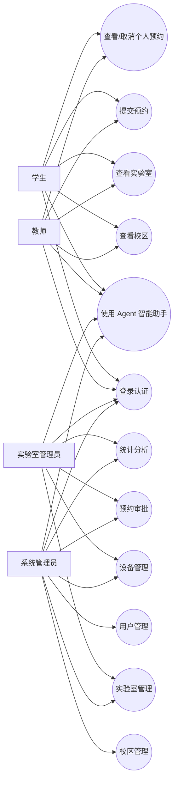

### 图2-2 预约需求流程图

放置位置：`2.3 功能需求` 中预约管理说明后。

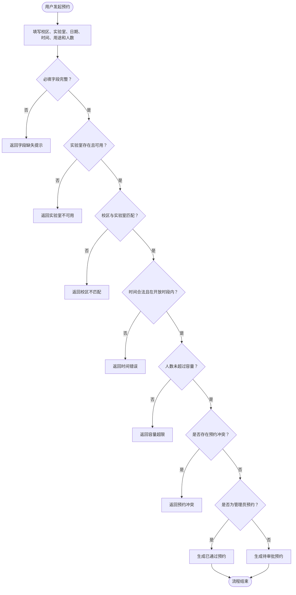

### 表2-1 用户角色与权限需求表

放置位置：`2.2 角色与权限需求` 后。

| 角色 | 主要使用场景 | 核心权限 |
| --- | --- | --- |
| 学生 | 实验学习、实践训练、个人预约 | 登录、查看校区与实验室、提交预约、查看和取消个人预约、使用 Agent |
| 教师 | 教学实验、科研实践、课程相关预约 | 登录、查询实验室资源、提交预约、查看个人预约、使用 Agent |
| 实验室管理员 | 本校区资源维护、预约审批、统计查看 | 管理本校区实验室和设备、审批本校区预约、查看本校区统计 |
| 系统管理员 | 全局系统维护、跨校区资源管理 | 管理全部校区、用户、实验室、设备、预约审批和系统统计 |

### 表2-2 功能需求表

放置位置：`2.3 功能需求` 开头。

| 功能模块 | 功能说明 | 使用角色 |
| --- | --- | --- |
| 用户认证与个人资料管理 | 登录认证、身份校验、个人资料维护、头像上传 | 全部用户 |
| 校区管理 | 校区新增、编辑、删除、查询和封面维护 | 系统管理员、普通用户 |
| 实验室管理 | 实验室新增、编辑、删除、查询、开放时间和图片维护 | 系统管理员、实验室管理员、普通用户 |
| 设备管理 | 设备新增、编辑、状态维护和设备查询 | 系统管理员、实验室管理员 |
| 预约管理 | 预约提交、冲突检测、预约取消和个人预约查询 | 学生、教师、管理员 |
| 审批管理 | 预约通过、拒绝和审批意见记录 | 系统管理员、实验室管理员 |
| 统计分析 | 总览统计、校区统计、实验室利用率统计 | 系统管理员、实验室管理员 |
| Agent 智能助手 | 自然语言查询预约、排期、可预约实验室和统计概况 | 全部用户 |

### 表2-3 预约业务规则表

放置位置：`2.3 功能需求` 中预约管理说明后。

| 规则编号 | 规则内容 | 处理方式 |
| --- | --- | --- |
| R1 | 必填字段不能为空 | 缺失时返回错误提示 |
| R2 | 实验室必须存在且状态可用 | 不满足则禁止预约 |
| R3 | 预约校区必须与实验室所属校区一致 | 不一致则返回校区不匹配 |
| R4 | 开始时间必须早于结束时间 | 不满足则返回时间错误 |
| R5 | 预约时间必须在实验室开放时间内 | 不满足则拒绝预约 |
| R6 | 预约人数不能超过实验室容量 | 超出则返回容量超限 |
| R7 | 不能与已有待审批或已通过预约冲突 | 冲突则拒绝提交 |
| R8 | 学生和教师预约默认待审批 | 创建 pending 状态预约 |
| R9 | 管理员预约可自动通过 | 创建 approved 状态预约 |

### 表2-4 非功能需求表

放置位置：`2.4 非功能需求` 后。

| 需求类型 | 具体要求 |
| --- | --- |
| 安全性 | 登录认证、角色权限控制、校区级数据隔离、上传文件限制 |
| 可用性 | 支持 Web 端和微信小程序端访问，降低使用门槛 |
| 可维护性 | 后端采用 API、Service、Model、Utils 分层结构 |
| 可扩展性 | 支持 SQLite/MySQL 切换，Agent 支持规则模式和 LLM 扩展 |
| 规范性 | 符合高校实验室安全管理和消防安全管理相关要求 |
| 可追踪性 | 记录预约、审批和关键管理操作日志 |

## 第3章 系统总体设计

第3章需要体现系统结构、流程和数据库设计。建议放 4 张图和 4 张表。

### 图3-1 系统总体架构图

放置位置：`3.1 总体架构设计` 后。

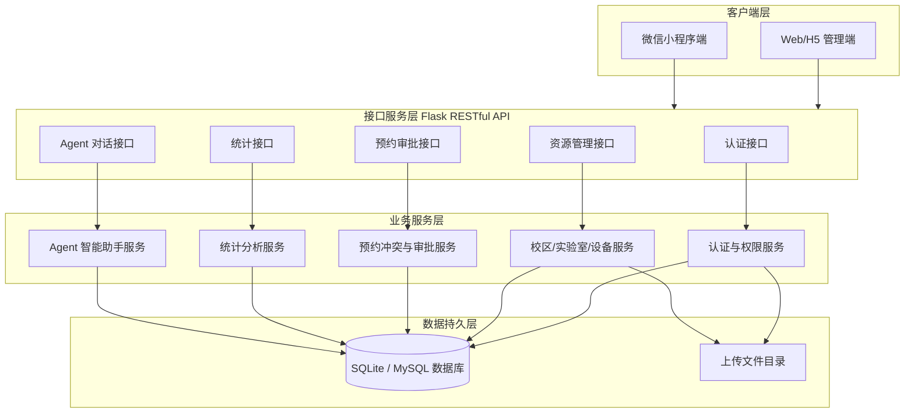

### 图3-2 登录认证流程图

放置位置：`3.3 核心业务流程设计` 中登录认证说明后。

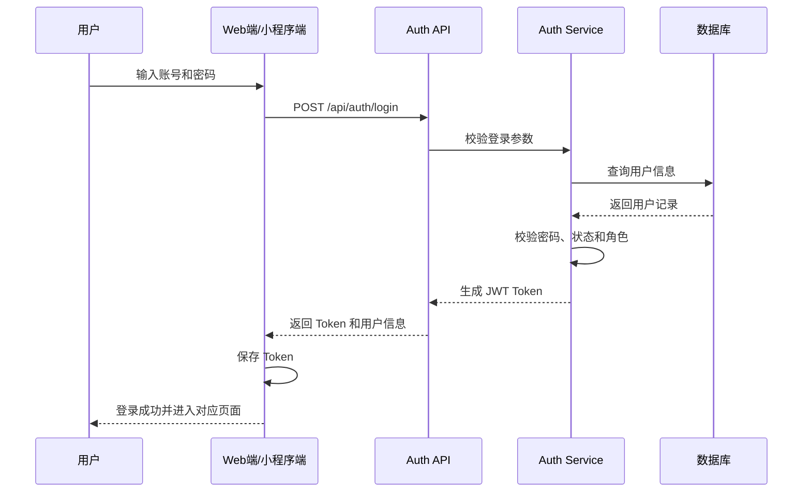

### 图3-3 预约创建流程图

放置位置：`3.3 核心业务流程设计` 中预约创建说明后。

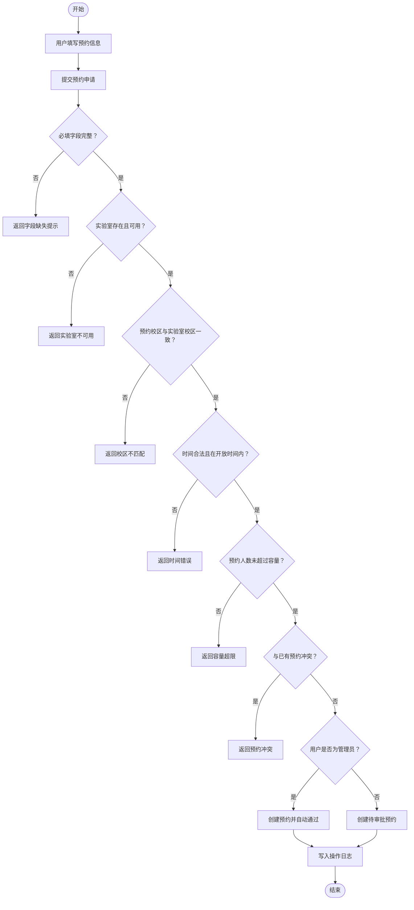

### 图3-4 数据库 E-R 图

放置位置：`3.5 数据库设计` 开头。

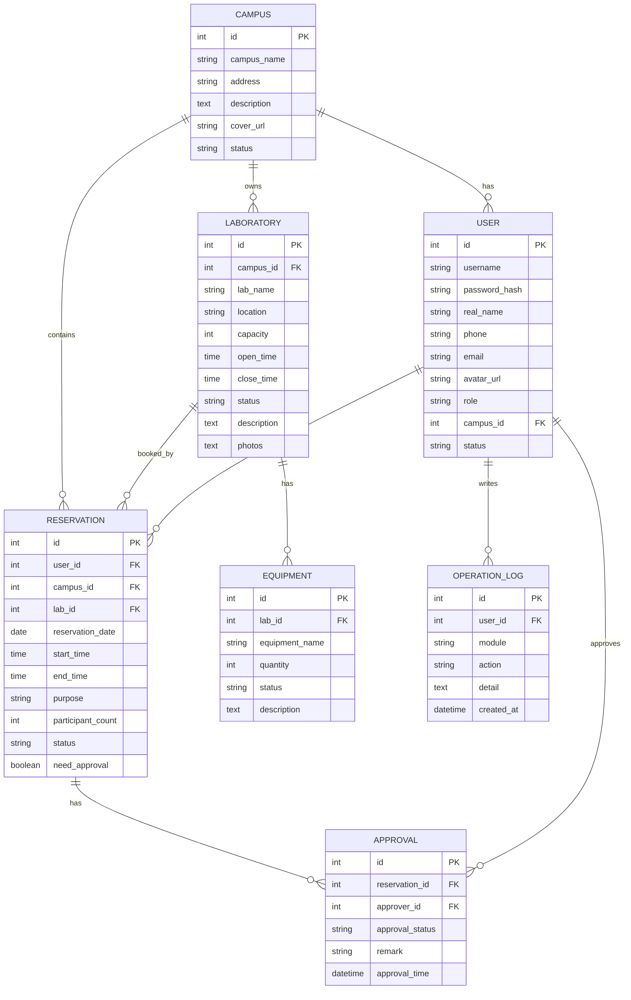

### 表3-1 系统分层结构说明表

放置位置：`3.2 分层架构设计` 后。

| 层次 | 对应目录/模块 | 主要职责 |
| --- | --- | --- |
| API 层 | `app/api` | 接收请求、参数解析、路由分发、调用服务层 |
| Service 层 | `app/services` | 处理预约冲突、审批流转、统计聚合、Agent 业务逻辑 |
| Model 层 | `app/models` | 定义数据模型、对象关系映射、实体序列化 |
| Utils 层 | `app/utils` | 统一响应、异常处理、字段校验、权限装饰器 |
| 配置层 | `app/config.py` | 数据库连接、JWT 密钥、上传目录、Agent 参数配置 |

### 表3-2 核心业务流程说明表

放置位置：`3.3 核心业务流程设计` 后。

| 流程名称 | 触发角色 | 主要步骤 |
| --- | --- | --- |
| 登录认证流程 | 全部用户 | 输入账号密码、验证用户、签发 JWT、返回用户信息 |
| 预约创建流程 | 学生、教师、管理员 | 填写预约信息、校验实验室、检测冲突、生成预约记录 |
| 审批流程 | 实验室管理员、系统管理员 | 查看待审批预约、通过/拒绝、记录审批意见 |
| 预约取消流程 | 预约发起人、管理员 | 校验权限、判断状态、更新预约为取消 |
| Agent 对话流程 | 全部用户 | 输入自然语言、识别意图、调用工具、返回回复和动作 |

### 表3-3 主要数据表说明表

放置位置：`3.5 数据库设计` 中 E-R 图后。

| 数据表 | 对应模型 | 主要用途 |
| --- | --- | --- |
| `campuses` | `Campus` | 保存校区基础信息 |
| `users` | `User` | 保存用户、角色和所属校区 |
| `laboratories` | `Laboratory` | 保存实验室基础信息和开放时间 |
| `equipment` | `Equipment` | 保存实验室设备信息 |
| `reservations` | `Reservation` | 保存预约申请、时间和状态 |
| `approvals` | `Approval` | 保存预约审批记录 |
| `operation_logs` | `OperationLog` | 保存关键操作日志 |

### 表3-4 预约表字段设计表

放置位置：`3.5 数据库设计` 中预约表说明后。

| 字段名 | 数据类型 | 含义 |
| --- | --- | --- |
| `id` | Integer | 预约编号 |
| `user_id` | Integer | 预约用户编号 |
| `campus_id` | Integer | 校区编号 |
| `lab_id` | Integer | 实验室编号 |
| `reservation_date` | Date | 预约日期 |
| `start_time` | Time | 开始时间 |
| `end_time` | Time | 结束时间 |
| `purpose` | String | 预约用途 |
| `participant_count` | Integer | 参与人数 |
| `status` | String | 预约状态 |
| `need_approval` | Boolean | 是否需要审批 |

## 第4章 关键模块设计与实现

第4章需要体现核心模块如何实现。建议放 4 张图和 3 张表。

### 图4-1 用户认证与权限校验流程图

放置位置：`4.1 用户认证与权限管理模块` 后。

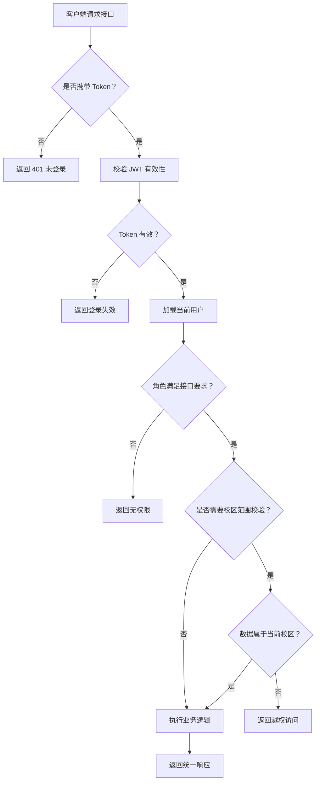

### 图4-2 资源管理模块关系图

放置位置：`4.2 校区/实验室/设备管理模块` 后。

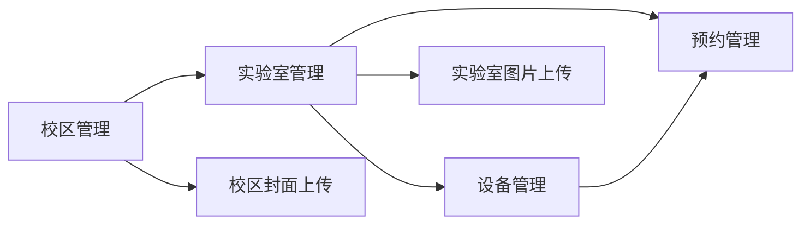

### 图4-3 预约审批状态流转图

放置位置：`4.3 预约与审批模块` 后。

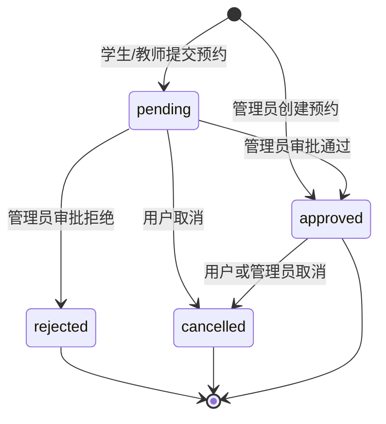

### 图4-4 前后端接口交互流程图

放置位置：`4.6 前后端接口交互设计` 后。

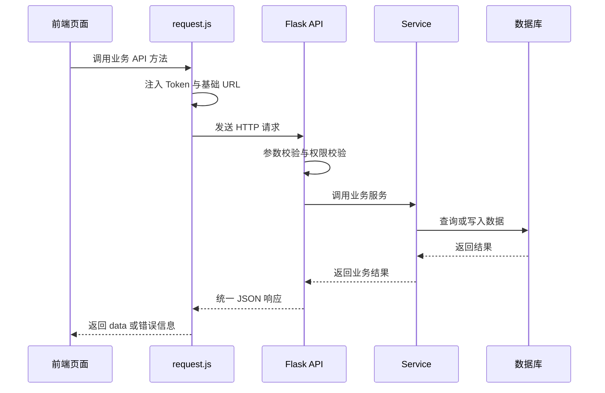

### 表4-1 核心接口说明表

放置位置：`4.6 前后端接口交互设计` 后。

| 模块 | 接口示例 | 说明 |
| --- | --- | --- |
| 认证 | `/api/auth/login` | 用户登录并返回 Token |
| 校区 | `/api/campuses` | 校区列表、详情和维护 |
| 实验室 | `/api/labs` | 实验室列表、详情、排期和维护 |
| 设备 | `/api/equipment` | 设备列表和维护 |
| 预约 | `/api/reservations` | 创建预约、取消预约、查询预约 |
| 审批 | `/api/approvals` | 待审批列表、通过或拒绝预约 |
| 统计 | `/api/statistics` | 总览统计、校区统计和利用率统计 |
| Agent | `/api/agent/chat` | Agent 智能助手对话 |

### 表4-2 预约校验规则实现表

放置位置：`4.3 预约与审批模块` 后。

| 校验项 | 校验目的 | 不通过处理 |
| --- | --- | --- |
| 必填字段 | 保证预约信息完整 | 返回字段缺失 |
| 实验室状态 | 保证实验室可预约 | 返回实验室不可用 |
| 校区匹配 | 避免跨校区错误预约 | 返回校区不匹配 |
| 时间顺序 | 保证开始时间早于结束时间 | 返回时间错误 |
| 开放时间 | 保证预约在开放时段内 | 返回不在开放时间 |
| 容量限制 | 避免超过实验室容量 | 返回容量超限 |
| 时间冲突 | 避免重复预约 | 返回预约冲突 |

### 表4-3 统一响应格式说明表

放置位置：`4.6 前后端接口交互设计` 后。

| 字段 | 类型 | 说明 |
| --- | --- | --- |
| `code` | Integer | 业务状态码，0 表示成功 |
| `message` | String | 响应提示信息 |
| `data` | Object/Array/null | 响应数据主体 |

## 第5章 Agent 智能助手模块设计与实现

第5章是创新点章节，需要重点配图和表。

### 图5-1 Agent 总体架构图

放置位置：`5.2 Agent 总体架构设计` 后。

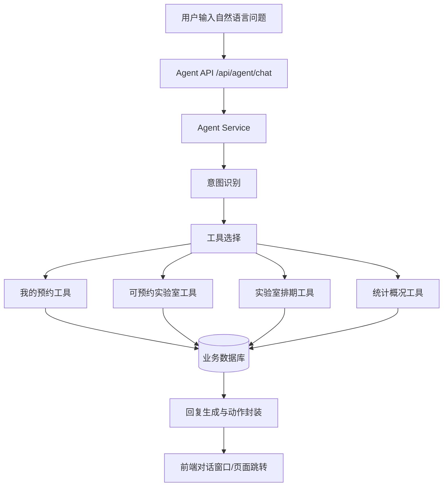

### 图5-2 Agent 意图识别与工具调用流程图

放置位置：`5.3 意图识别与规则模式设计` 后。

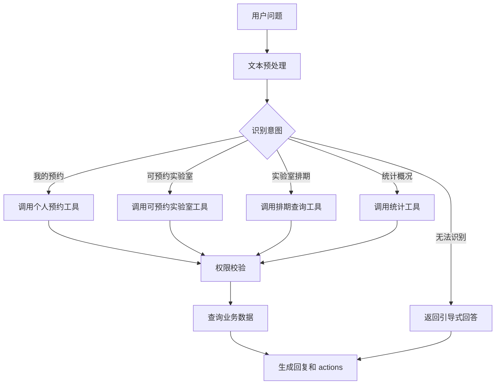

### 图5-3 Agent 页面动作返回流程图

放置位置：`5.6 Agent 前端交互与应用效果` 后。

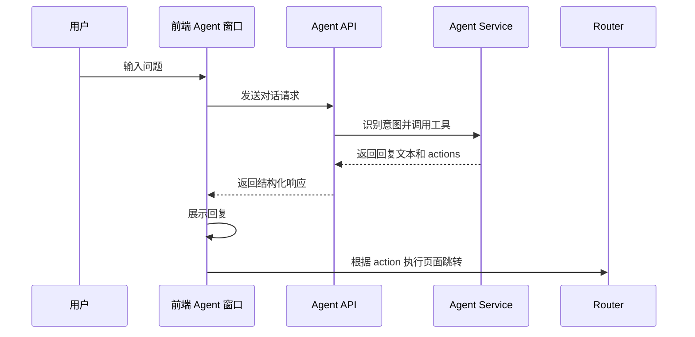

### 表5-1 Agent 意图类型说明表

放置位置：`5.3 意图识别与规则模式设计` 后。

| 意图类型 | 示例问句 | 调用工具 |
| --- | --- | --- |
| 个人预约查询 | 我的预约有哪些？ | 我的预约工具 |
| 可预约实验室查询 | 明天有哪些实验室可以预约？ | 可预约实验室工具 |
| 实验室排期查询 | 查看某实验室今天的排期 | 排期查询工具 |
| 统计概况查询 | 查看系统统计概况 | 统计工具 |
| 帮助引导 | 我可以问什么？ | 引导回复 |

### 表5-2 Agent 工具调用能力表

放置位置：`5.4 工具调用与业务数据访问` 后。

| 工具名称 | 数据来源 | 权限要求 | 输出内容 |
| --- | --- | --- | --- |
| 我的预约工具 | reservations | 登录用户本人 | 个人预约列表 |
| 可预约实验室工具 | laboratories, reservations | 登录用户 | 可预约实验室列表 |
| 排期查询工具 | reservations | 登录用户 | 指定实验室排期 |
| 统计工具 | statistics | 管理员角色 | 统计概况 |
| 页面动作工具 | navigation config | 登录用户 | 跳转路径和动作 |

### 表5-3 Agent 测试问句与预期结果表

放置位置：`5.6 Agent 前端交互与应用效果` 或第6章 Agent 测试。

| 测试问句 | 预期意图 | 预期结果 |
| --- | --- | --- |
| 我的预约有哪些？ | 个人预约查询 | 返回当前用户预约列表 |
| 明天有哪些实验室可以预约？ | 可预约实验室查询 | 返回符合条件的实验室 |
| 查看实验室A今天排期 | 实验室排期查询 | 返回该实验室排期 |
| 查看统计概况 | 统计概况查询 | 管理员返回统计，普通用户提示无权限 |
| 你好 | 帮助引导 | 返回可询问内容示例 |

## 第6章 系统测试与结果分析

第6章建议以测试环境、测试流程和测试用例表为主。

### 图6-1 系统测试流程图

放置位置：`6.1 测试环境与测试方法` 后。

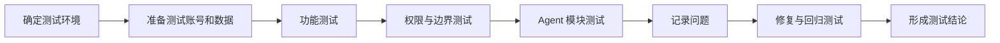

### 表6-1 测试环境表

放置位置：`6.1 测试环境与测试方法` 后。

| 环境项 | 配置 |
| --- | --- |
| 操作系统 | Windows |
| 后端环境 | Python + Flask |
| 数据库 | SQLite / MySQL |
| Web 端 | 浏览器 / HBuilderX |
| 小程序端 | 微信开发者工具 |
| 接口测试 | 浏览器、前端页面或接口工具 |

### 表6-2 功能测试用例表

放置位置：`6.2 功能测试` 后。

| 测试编号 | 测试模块 | 测试内容 | 预期结果 |
| --- | --- | --- | --- |
| F01 | 登录 | 正确账号密码登录 | 登录成功并返回用户信息 |
| F02 | 校区管理 | 新增/编辑校区 | 数据保存成功 |
| F03 | 实验室管理 | 新增/编辑实验室 | 实验室信息保存成功 |
| F04 | 设备管理 | 新增/修改设备状态 | 设备状态更新成功 |
| F05 | 预约管理 | 提交合法预约 | 生成预约记录 |
| F06 | 审批管理 | 审批通过预约 | 预约状态变为 approved |
| F07 | 统计分析 | 查看统计数据 | 返回统计结果 |

### 表6-3 权限与边界测试用例表

放置位置：`6.3 权限与边界测试` 后。

| 测试编号 | 测试内容 | 预期结果 |
| --- | --- | --- |
| P01 | 未登录访问敏感接口 | 返回未登录提示 |
| P02 | 学生访问管理接口 | 返回无权限 |
| P03 | 实验室管理员访问其他校区数据 | 返回越权提示 |
| B01 | 超容量预约 | 拒绝预约 |
| B02 | 开放时间外预约 | 拒绝预约 |
| B03 | 冲突时间段预约 | 返回预约冲突 |

### 表6-4 Agent 模块测试用例表

放置位置：`6.5 Agent 模块测试` 后。

| 测试编号 | 输入内容 | 预期结果 |
| --- | --- | --- |
| A01 | 我的预约 | 返回当前用户预约 |
| A02 | 明天有哪些实验室可以预约 | 返回可预约实验室列表 |
| A03 | 查看某实验室排期 | 返回排期信息 |
| A04 | 统计概况 | 管理员返回统计，普通用户提示无权限 |
| A05 | 无法识别问题 | 返回引导式回答 |

## 第7章 系统运行展示与应用效果

第7章不再放开发部署方案，重点放系统页面展示和应用效果分析。

### 表7-1 系统页面展示说明表

放置位置：`7.1 系统运行展示` 后。

| 页面 | 展示内容 |
| --- | --- |
| 登录页 | 用户登录入口 |
| 首页 | 系统概览和快捷入口 |
| 校区列表 | 多校区信息展示 |
| 实验室列表 | 实验室资源查询 |
| 实验室详情 | 实验室开放时间、容量和设备信息 |
| 预约页面 | 预约信息填写与提交 |
| 我的预约 | 用户个人预约记录 |
| 审批页面 | 管理员处理待审批预约 |
| 统计页面 | 校区和实验室统计数据 |
| Agent 页面 | 智能助手对话交互 |

### 表7-2 应用效果分析表

放置位置：`7.2 应用效果分析` 后。

| 分析维度 | 应用效果 |
| --- | --- |
| 预约效率 | 用户可在线查询和提交预约 |
| 管理规范性 | 预约审批和操作日志可追踪 |
| 跨校区协作 | 支持多校区资源统一管理 |
| 多端便利性 | Web 端和小程序端协同使用 |
| 智能辅助 | Agent 支持自然语言查询和页面引导 |

## 第8章 总结与展望

第8章通常不强制放图表。若篇幅需要，可放总结表。

### 表8-1 本文主要工作总结表

放置位置：`8.1 工作总结` 后。

| 工作内容 | 完成情况 |
| --- | --- |
| 多角色权限体系 | 已实现学生、教师、实验室管理员和系统管理员角色 |
| 跨校区资源管理 | 已实现校区、实验室和设备统一管理 |
| 预约审批流程 | 已实现预约冲突检测、审批和取消 |
| 统计分析 | 已实现总览、校区和实验室利用率统计 |
| 多端访问 | 已实现 Web/H5 端和微信小程序端 |
| Agent 智能助手 | 已实现规则模式下的业务问答与工具调用 |

